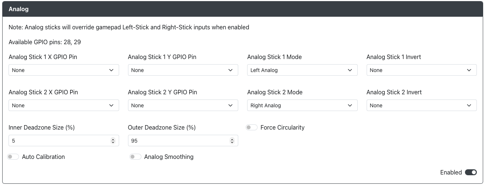

# Analog (Internal ADC)

**Purpose:** Enable the use of analog joysticks using the built-in ADC of the RP2040.

## Web Configurator Options

- `Analog Stick 1 X Pin` - The GPIO pin used for the Analog joystick 1 X value. Only ADC pins 26, 27, 28 and 29 are allowed here.
- `Analog Stick 1 Y Pin` - The GPIO pin used for the Analog joystick 1 Y value. Only ADC pins 26, 27, 28 and 29 are allowed here.
- `Analog Stick 1 Mode` - Choose if Analog joystick 1 is to be used for Left Analog or Right Analog.
- `Analog joystick 1 Invert` - Choose if you would like to flip the X or Y axis Analog Stick 1 inputs (or both).
- `Analog joystick 2 X Pin` - The GPIO pin used for the Analog Stick 2 X value. Only ADC pins 26, 27, 28 and 29 are allowed here.
- `Analog joystick 2 Y Pin` - The GPIO pin used for the Analog Stick 2 Y value. Only ADC pins 26, 27, 28 and 29 are allowed here.
- `Analog joystick 2 Mode` - Choose if Analog Stick 2 is to be used for Left Analog or Right Analog (must be different than Analog Stick 1).
- `Analog joystick 2 Invert` - Choose if you would like to flip the X or Y axis Analog joystick 2 inputs (or both).
- `Deadzone Size (%)` - Enter the % value of dead zone you would like on the analog joysticks.
- `Forced Circularity` - Force the analog joysticks to be bound within a perfect circle. This can be beneficial for certain games. However, be aware that this may negatively impact some games which account for sticks moving outside of a circle.
- `Auto Calibration` - Automatically centers the analog joysticks. This works by reading in the offset from center during boot and then accounts for that until the next power cycle. This can be helpful for analog joysticks experiencing drift.

## Hardware

### Requirements

A minimum of one hardware analog joystick is required for the use of this add-on.

Each joystick will require the use of 2 Analog to Digital Converter (ADC) pins to operate.

:::note Check ADC Pin Availability!!!

The **Raspberry Pi Pico and some of its clone boards do not expose GPIO 29**, leaving only 3 usable ADC GPIO pins: **26, 27, 28**.
Keep this in mind when designing hardware that uses analog inputs from one of these boards, or similar boards that don't expose all
4 of the RP2040 ADC pins, as this will limit the number of joysticks that can be used.

:::

### Installation

Connect the pins of the analog joystick to the board as follows and then set the GPIO pin values in `Web Configurator > Configurations > Add-Ons > Analog`.

- Reference Voltage (ADC_VREF/3.3V) -> ADC_VREF/3.3V Pin
- X-Axis Input Voltage (Vx) -> Any ADC GPIO Pin
- Y-Axis Input Voltage (Vy) -> Any ADC GPIO Pin
- Ground (GND) -> Any GND Pin

:::note Joystick Buttons

The analog joystick may have an additional pin for the joystick button. This can be connected to any GPIO pin and used as a regular button.

:::

The specific location of the ADC pins on your board will vary depending on the design and manufacturer, but they will always be one of the following GPIO pins on the RP2040

- GPIO 26
- GPIO 27
- GPIO 28
- GPIO 29

## Miscellaneous Notes

Both potentiometer and Hall Effect based joysticks are supported, provided that they use a 3.0-3.3V reference voltage and output voltages in the range of 0-3.3V as an input for the RP2040. This is because the GPIO pins for the RP2040 utilize 3.3V logic and are not 5V-safe.
