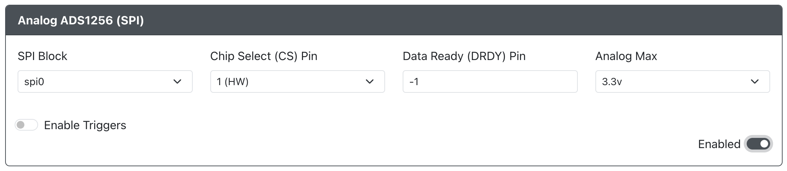

# Analog (SPI ADC ADS1256)

**Purpose:** Enable the use of analog joysticks and triggers using an ADS1256 8-channel, 24-bit analog-to-digital
converter (ADC) module via the SPI bus.

:::info SPI Setup

This addon requires SPI to be configured in [`Peripheral Mapping`](../web-configurator/menu-pages/03-peripheral-mapping.mdx#spi)
in order to be used.

:::

:::caution BETA

Please note the `Analog (SPI ADC ADS1256)` feature is currently in beta.
Please create a [Bug Report](https://github.com/OpenStickCommunity/GP2040-CE/issues/new?labels=bug&template=issue---bug-report.md)
if you find any issues.

:::

## Web Configurator Options

- `SPI Block` - The [`SPI Block`](../web-configurator/menu-pages/03-peripheral-mapping.mdx#spi) to use (spi0 or spi1).
- `Chip Select (CS) Pin` - The GPIO pin to use for Chip Select signal. The option labeled `(HW)` is the hardware CS pin configured
                           for the [`SPI Block`](../web-configurator/menu-pages/03-peripheral-mapping.mdx#spi).
- `Data Ready (DRDY) Pin` - The GPIO pin to use for the Data Ready signal.
- `Analog Max` - The maximum voltage to be used for analog reads. Options are `3.3V` and `5V`.
- `Enable Triggers` - Flag to enable reading and reporting of triggers with this module.

### Setting Analog Max Value

The ADS1256 requires an analog source voltage of 5V. This allows joysticks and analog triggers to use either 3.3V or 5V as a
reference voltage (VREF). Set the `Analog Max` value to match the VREF of your analog controls.

## Hardware

### Requirements

This add-on requires an ADS1256 analog-to-digital converter (ADC) to function properly.

### Installation

Connect the pins on the ADS1256 according to the table below

| ADS1256 Pin | Connects To                   |
| :---------: | ----------------------------- |
|    DIN      | SPI Block TX                  |
|    DOUT     | SPI Block RX                  |
|    CS*      | SPI Block CS                  |
|    SCLK     | SPI Block SCK                 |
|    DRDY     | Data Ready (DRDY) Pin         |
|    AIN0     | Left analog joystick X-Axis   |
|    AIN1     | Left analog joystick Y-Axis   |
|    AIN2     | Right analog joystick X-Axis  |
|    AIN3     | Right analog joystick Y-Axis  |
|    AIN4**   | Left trigger Axis             |
|    AIN5**   | Right trigger Axis            |

\* The ADS1256 CS pin can optionally be attached to any other available GPIO pin if there are multiple SPI devices on the same
[`SPI Block`](../web-configurator/menu-pages/03-peripheral-mapping.mdx#spi).

\** Requires the `Enable Triggers` option to be enabled.

## Miscellaneous Notes

These installation instructions do not cover the additional circuitry required for the use of the ADS1256 ADC, only the wiring to
the RP2040 and analog controls.

[ADS1256 Product Sheet](https://www.ti.com/lit/ds/symlink/ads1256.pdf)
