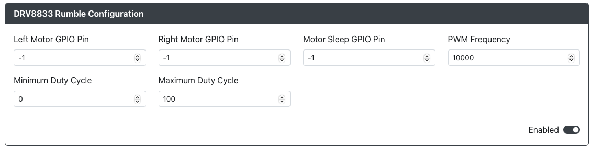

# ODRV8833 Rumble

Purpose: This add-on is allows you to use DRV8833 Rumble in Xinput mode.

## Web Configurator Options

-`Left Motor GPIO Pin` - The GPIO pin that the left motor `AIN1` is connected to on the DRV8833.
-`Right Motor GPIO Pin` - The GPIO pin that the left motor `AIN2` is connected to on the DRV8833.
-`Motor Sleep GPIO Pin` - The GPIO pin that `SLP` is connected to on the DRV8833.
-`PWM Freaquency` - The freaquency for the motors (best to start at 10,000 and adjust from there).
- `Minimum Duty Cycle` - The bottom range as a percentage for the 0-255 rumble value.
- `Maximum Duty Cycle` - The top range as a percentage for the 0-255 rumble value.

### Requirements

This add-on requires an DRV8833 motor driver or breakout and either one or two rumble motors.