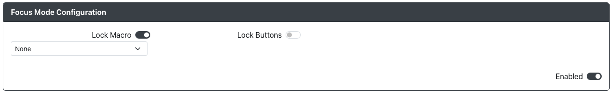

# Focus Mode Configuration

Purpose: This add-on is intended to allow you to disable a number of functions or inputs while Focus Mode is enabled, but otherwise still retain access to them.

## Web Configurator Options

- `Lock Macro` - When enabled, macro triggers will not activate macro sequences during Focus Mode
- `Lock Buttons` - When enabled, listed inputs will not be sent during Focus Mode. As inputs are added, new dropdowns will appear for additional inputs.

Please note that focus mode pin can be set on the main pin mapping page.

## Hardware

### Requirements

The GPIO pin set in `Focus Mode Pin` needs to be brought and kept low to remain active. A toggle switch, slide toggle, or latching switch is necessary to take advantage of the `Focus Mode Pin`.

Focus mode can also be toggled without a physical switch via the hotkey action [Focus Mode Toggle](../hotkeys.mdx#focus-mode-toggle) (which can be configured in [Hotkeys Settings](../web-configurator/menu-pages/01-settings.mdx#hotkey-settings)).

### Installation

Installation will depend on whether a toggle switch, slide toggle, or latching switch is used. In general, on one side of the switch, connect the pin to the GPIO pin set in `Focus Mode Pin`. On the other side of the switch or the center if there are 3 contacts, connect it to any GND pin.

## Miscellaneous Notes

None.
