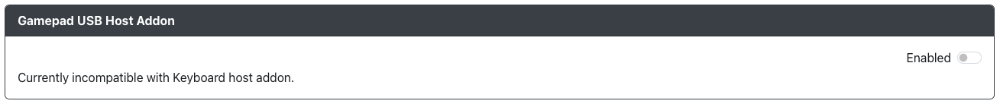

# FGamepad USB Host Configuration

Purpose: This add-on is intended to allowgamepads to be used inline with GP2040-CE.  As example of this would be plugging a supported USB controller into an available USB host port and then playing on the USB controller.  This can be used to convery a supported controller to work on a system it was not intended to work on.

## Web Configurator Options

Currently you can only enable or disable the addon.  

Please note that currently you must choose between `Keyboard host` or `Gamepad USB host`.

## Hardware

You will require one of the following gamepads for this addon to work:
- Sony Dualshock 4 controller
- Google Stadia controller
- Ultrastick 360 (pre-2015)
- Ultrastick 360

### Requirements

:::note

Please note that more controller support may come in the future.  We are not currently taking requests for additional controllers to be added.

:::