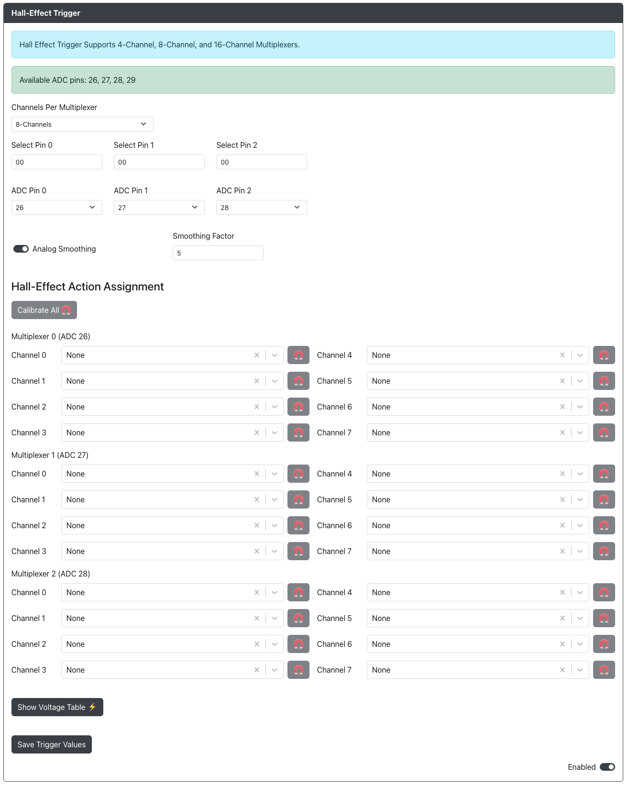
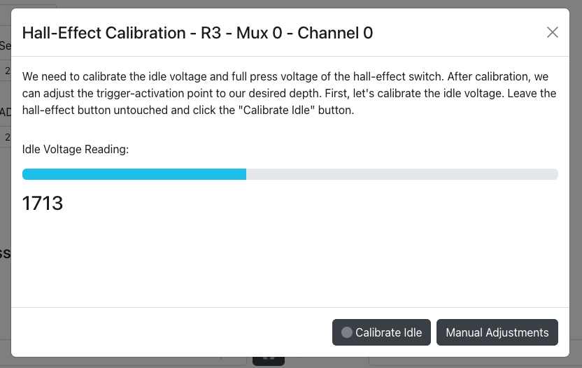
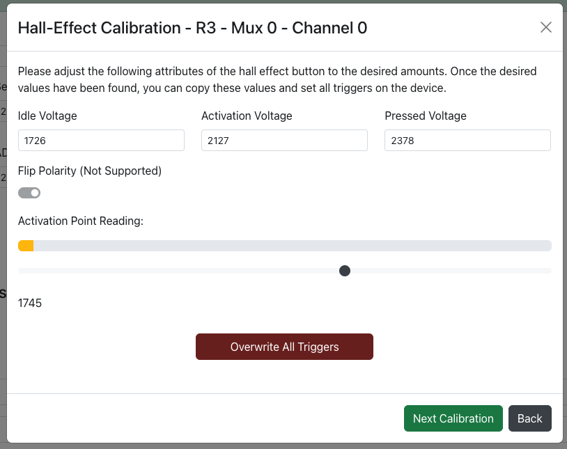
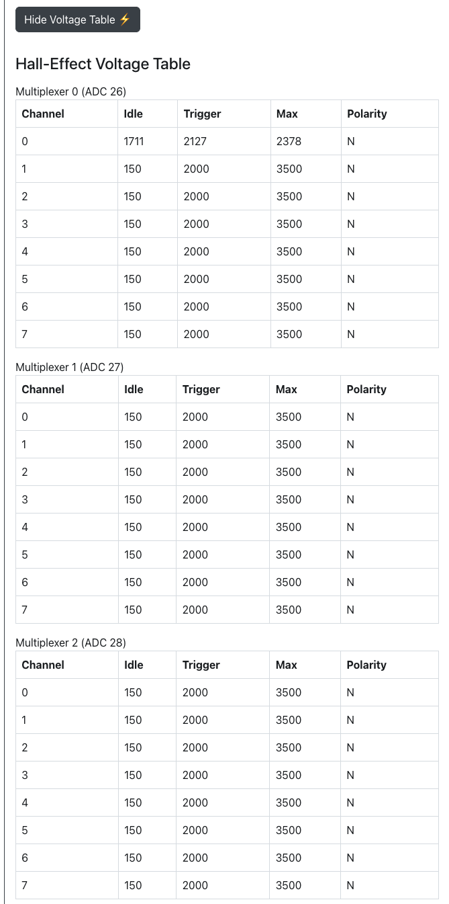

# Hall-Effect Trigger

Purpose: This add-on is intended for the use of hall-effect buttons either on their own or through the use of a multiplexer breakout board.

## Web Configurator Options

- `Channels Per Multiplexer` - The number of channels on your multiplexer or multiplexers.  Please note that if you are using multiple they must all be the same.  If using no multiplexers and connecting direction select `Direct (No Mux)`
- `Select Pin 0` - The GPIO pin used for the select pin on your multiplexer or multiplexers.
- `Select Pin 1` - The GPIO pin used for the select pin on your multiplexer or multiplexers.
- `Select Pin 2` - The GPIO pin used for the select pin on your multiplexer or multiplexers.
- `Select Pin 3` - The GPIO pin used for the select pin on your multiplexer or multiplexers.
- `ADC Pin 0` - The ADC GPIO pin used for the first multiplexer or individual hall-effect switch.
- `ADC Pin 1` - The ADC GPIO pin used for the second multiplexer or individual hall-effect switch.
- `ADC Pin 2` - The ADC GPIO pin used for the third multiplexer or individual hall-effect switch.
- `ADC Pin 3` - The ADC GPIO pin used for the fourth multiplexer or individual hall-effect switch.
- `Analog Smoothing` - Enabled analog smoothing which may be useful if you are getting noisy readings.
- `Smoothing Factor` - An EMA value between 1 and 99.  A value of 1 is the most smoothing and a value of 99 is the least smoothing.

## Calibrating

### How to calibrate hall-effect switches

All connected hall-effect switches will need to be calibrated either individually or all at once.  In most cases it is recommended to calibrate all hall-effect buttons at the same time unless you are using different types of hall-effect switches.

1 - Press the `Calibrate All` button or press the magnet button for any one individual multiplexer channel.
2 - With the button not pressed wait for the `Idle Voltage Reading` to settle.
3 - Press the `Calibrate Idle` button
4 - Full press the hall-effect switch.  While still holding the switch fully pressed press the `Calibrate Pressed` button.

Advanced calibration can also be done manually by pressing the `Manual Adjustments` button.

Inside advanced calibration the following options are available:
- `Idle Voltage` - The voltage of the switch at idle.
- `Activation Voltage` - The voltage of the switch at the activation point you would like to set.
- `Pressed Voltage` - The voltage of the switch at the maximum pressed value.
- `Flip Polarity` - Not yet supported.

The `Activation Point Reading` section will give you a live view of your hall-effect switch as you press it.

If you are in the `Calibrate All` section you will see an `Overwrite All Triggers` button that will allow you to overwrite all preiously saved settings.

## Hall-Effect Voltage Table

The hall-effect voltage table will give you a summary of all current settings for your hall-effect switches.

:::note

Please ensure you click on the `Save Trigger Values` before navigating to another page in web-config or rebooting to controller mode or your changes will not be saved.

:::