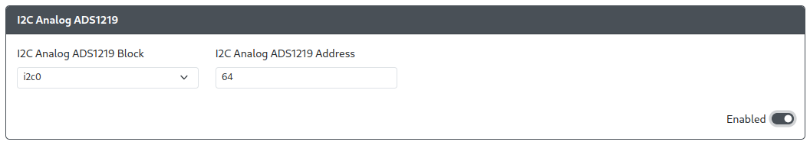

import I2CTable from "../snippets/_i2c-block-table.mdx";

# I2C Analog ADS1219

Purpose: This add-on is intended to allow you to add Left and Right analog joystick functionality using the ADS1219 24-bit, analog-to-digital
converter (ADC).

## Web Configurator Options

:::info GPIO Pin Assignment

The SDA and SCL pins for I2C and speed are now configured in [`Configuration > Peripheral Mapping - I2C`](../web-configurator/menu-pages/03-peripheral-mapping.mdx#i2c).

:::

- `I2C Analog ADS1219 Block` - The block of I2C to use (i2c0 or i2c1).
- `I2C Analog ADS1219 Address` - Sets the address for the I2C Analog ADS1219 based on the pins used for SDA and SCL according to the table below.

| A0  | A1  | I2C Address |
| :-: | --- | :---------: |
| SDA | SCL |   1001110   |
| SCL | SDA |   1001011   |

## Hardware

### Requirements

This add-on requires an ADS1219 analog-to-digital converter (ADC) to function properly.

### Installation

Connect the pins on the ADS1219 according to the table below

| ADS1219 Pin | Function                     |
| :---------: | ---------------------------- |
|     A0      | SDA or SCL                   |
|     A1      | SDA or SCL                   |
|    AIN0     | Left analog joystick X-Axis  |
|    AIN1     | Left analog joystick Y-Axis  |
|    AIN2     | Right analog joystick X-Axis |
|    AIN3     | Right analog joystick Y-Axis |

 

:::info A0/A1 GPIO Assignment

These pins will need to be wired to the appropriate SDA/SCL pins on the RP2040 and set the correct I2C block in Web Configurator.

See [Peripheral Mapping](../web-configurator/menu-pages/03-peripheral-mapping.mdx#i2c) for more information on setting up I2C.

:::

## Miscellaneous Notes

These installation instructions do not cover the additional circuitry required for the use of the ADS1219 ADC, only the wiring to the RP2040.

[ADS1219 Product Sheet](https://www.ti.com/lit/ds/symlink/ads1219.pdf)
