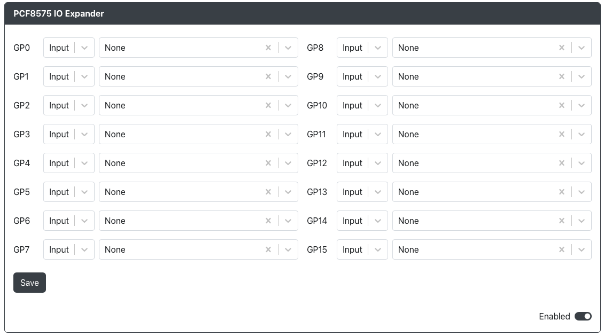

# PCF8575 IO Expander

Purpose: This add-on is allows you to use a PCF8575 based IO Expander.

## Web Configurator Options

For each of the 16 available expander pins you have the ability to set them as input or output pins and choose which button will be tied to them.

### Requirements

This add-on requires an PCF8575 based IO expander.