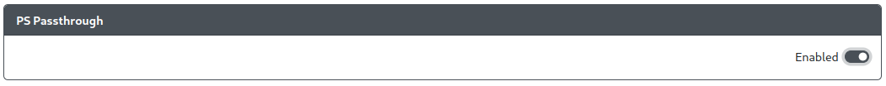

import InstallUSBHostPort from "../snippets/_add-usb-host-port.mdx";

# PS Passthrough

Purpose: This add-on is intended to allow you to use a licensed 3rd party, "categorized" device to authenticate with a Playstation 4 or Playstation 5.

## Web Configurator Options

:::info GPIO Pin Assignment

The Data, 5V Enable, and Pin Orientation options for USB host ports are now configured in [`Configuration > Peripheral Mapping - USB Host`](../web-configurator/menu-pages/03-peripheral-mapping.mdx#usb-host).

:::

:::caution

If you have PS Passthrough enabled, you must turn off the `PS4 Mode` add-on as the two will not work together.

Ensure that, under the `Settings` section, you have set the input mode as `PS4` and the `Controller Mode` as `Arcade Stick`. The PS Passthrough add-on will not work otherwise.

:::

## Hardware

### Requirements

This add-on requires that you have a USB host port available on your device connected to GPIO pins on the RP2040 board. There are a number of methods to do so.

See [USB Host Port Installation](../controller-build/usb-host.mdx) for more information on the requirements for adding a USB host port to your controller.

A passthrough authentication device is also required for authentication of the controller by the console. See [FAQ: Console Compatibility](../faq/faq-ps4-ps5-compatibility.mdx#what-controller-or-dongle-do-i-use-for-ps-passthrough) for more information on which passthrough authentication devices will work for this add-on.

### Installation

<InstallUSBHostPort />

## Miscellaneous Notes

This add-on is not compatible with the [PS4 Mode](./ps-passthrough.mdx) add-on. In order to use one, the other must be disabled.
