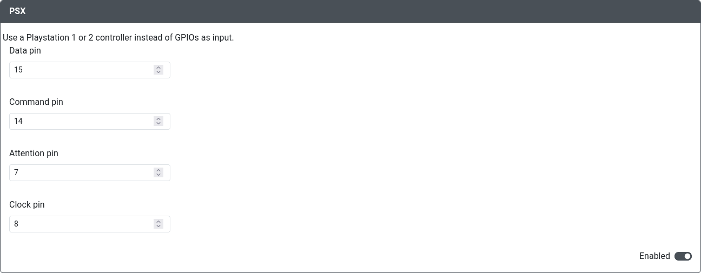
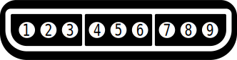

import InputLabelSelector, {
	Hotkey,
} from "@site/src/components/LabelSelector.tsx";

# PSX Input

Select the button labels to be displayed in the usage guide:

<InputLabelSelector />
 

Purpose: This add-on is intended to allow you to use a GP2040-CE as an adapter to connect an Playstation 1 or 2.

It currently only supports digital pads, but support for analog sticks and dualshock 2 analog triggers may be added later.

## Web Configurator Options

- `Data Pin` - The GPIO pin used for Psx Data.
- `Command Pin` - The GPIO pin used for Psx Command.
- `Attention Pin` - The GPIO pin used for Psx Attention.
- `Clock Pin` - The GPIO pin used for Psx Clock.

Supported controller types and their mapping is as follows:

| GP2040                        | PSX      |
| ----------------------------- | ---------|
| <Hotkey buttons={["Up"]}/>    | Up       |
| <Hotkey buttons={["Down"]}/>  | Down     |
| <Hotkey buttons={["Left"]}/>  | Left     |
| <Hotkey buttons={["Right"]}/> | Right    |
| <Hotkey buttons={["B1"]}/>    | Cross    |
| <Hotkey buttons={["B2"]}/>    | Round    |
| <Hotkey buttons={["B3"]}/>    | Square   |
| <Hotkey buttons={["B4"]}/>    | Triangle |
| <Hotkey buttons={["L1"]}/>    | L1       |
| <Hotkey buttons={["R1"]}/>    | R1       |
| <Hotkey buttons={["L2"]}/>    | L2       |
| <Hotkey buttons={["R2"]}/>    | R2       |
| <Hotkey buttons={["S1"]}/>    | Select   |
| <Hotkey buttons={["S2"]}/>    | Start    |

## Hardware

### Requirements

SNES extension cable with individual wires, or just directly wire from the controller.

### Installation

This is a front view of the **male** snes connector, the one on the controller side.
You will also see the pins in the same order if you solder wires on the **rear** of the female connector.

Connect the SNES pins to the GPIO pins on the RP2040 board following this table.

| Pin number | Function      | Rp2040 board pin                 |
|------------|---------------|----------------------------------|
| 1          | Data          | `Data Pin` in web interface      |
| 2          | Command       | `Command Pin` in web interface   |
| 3          | 7V (rumble)   | -                                |
| 4          | GND           | GND                              |
| 5          | 3V3           | 3V3                              |
| 6          | Attention     | `Attention Pin` in web interface |
| 7          | Clock         | `Clock Pin` in web interface     |
| 8          | -             | -                                |
| 9          | Acknowledge   | -                                |

## Miscellaneous Notes

None.
