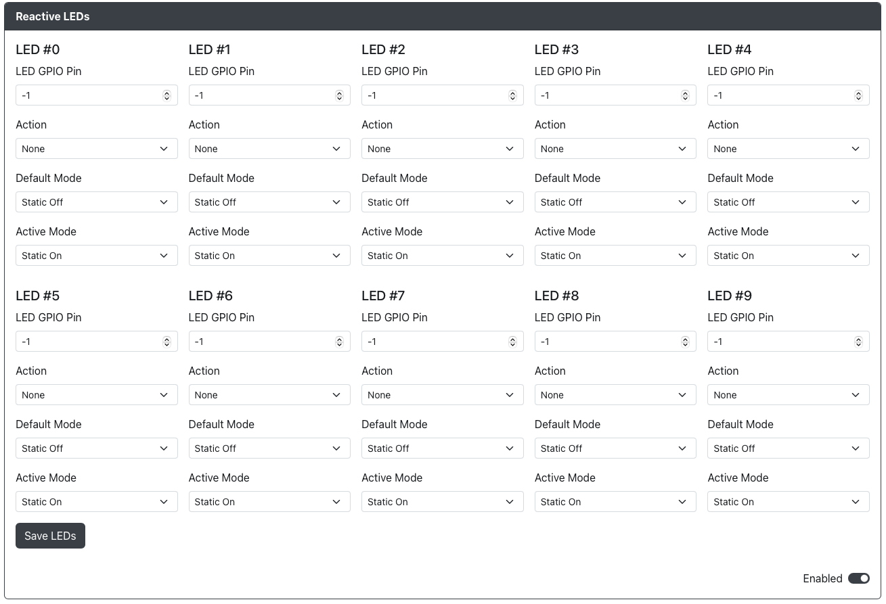

# Reactive LEDs Configuration

Purpose: This add-on allows you to setup reactive single color LEDs that are connected to GPIOs.

## Web Configurator Options

There are 10 total LEDs that can be configured through web-config.  For each LED you have the following options:

LED X
`LED GPIO Pin` - The GPIO pin that the LED is connected to.
`Action` - Choose which action will trigger this LED.
`Default Mode` - Choose the behaviour when this action is not enabled.
`Active Mode` - Choose the behaviour when this action is enabled.

## Hardware

You will require LEDs connected to the GPIO pin and ground.