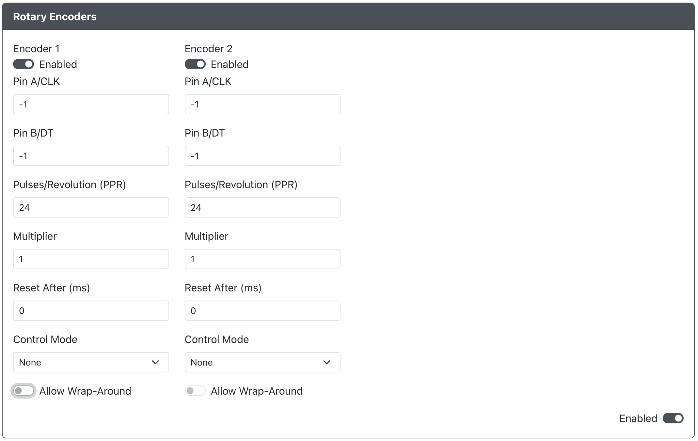

# Rotary Encoders

**Purpose:** `Rotary Encoders` allows for continuous or limited min-max pulses on specified pins.
Up to 2 rotary encoders can be enabled.

:::caution BETA

Please note the `Rotary Encoders` feature is currently in beta.
Please create a [Bug Report](https://github.com/OpenStickCommunity/GP2040-CE/issues/new?labels=bug&template=issue---bug-report.md)
if you find any issues.

:::

## Web Configurator Options

- `Enabled` - Enables or disables `Encoder 1` or `Encoder 2`.
- `Pin A/CLK` - The `Clock` pin for the encoder.
- `Pin B/DT` - The `Data` pin for the encoder`.
- `Pulses/Revolutions (PPR)` - The number of pulses/revolutions on your encoder.
- `Multiplier` - Use this multiplier to fine tune your encoder performance in GP2040-CE.
- `Reset After (ms)` - The number of miliseconds to wait before resetting the reported encoder value to neutral, or no output.
                       A value of `0` will disable resetting the reported encoder value.
- `Control Mode` - Choose how this encoder will function.
- `Allow Wrap-Around` - Allows the reported encoder value to wrap around to the min or max value when continually
                        rotating in a single direction.

## Hardware

At this time we do not have recommended modules. This is a newly introduced feature.
