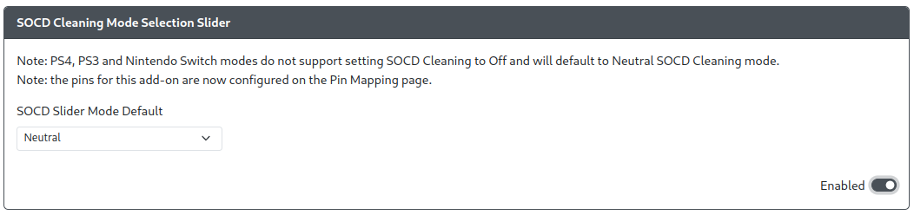

# SOCD Selection Slider

Purpose: This add-on is intended to allow users change the method of SOCD cleaning using a two/three position toggle switch or slide toggle.

## Web Configurator Options

- `SOCD Slider Mode Default` - The default SOCD mode to be used when the slider pin is not activated.

:::info GPIO Pin Mapping Moved

The pin(s) are now configured on the [GPIO Pin Mapping page](../web-configurator/menu-pages/02-gpio-pin-mapping.mdx) by choosing the correct option for the selected pin.

- [Up Priority SOCD Cleaning](../hotkeys.mdx#socd-up-priority)
- [Neutral SOCD Cleaning](../hotkeys.mdx#socd-neutral)
- [Last Win SOCD Cleaning](../hotkeys.mdx#socd-last-win)
- [First Wins SOCD Cleaning](../hotkeys.mdx#socd-first-win)
- [SOCD Cleaning Off](../hotkeys.mdx#socd-cleaning-off)

:::

- `SOCD Slider Mode Default` - The SOCD cleaning mode that is active when no `SOCD Cleaning Mode` pins are held.
  - [Up Priority](../hotkeys.mdx#socd-up-priority)
  - [Neutral](../hotkeys.mdx#socd-neutral)
  - [Last Win](../hotkeys.mdx#socd-last-win)
  - [First Wins](../hotkeys.mdx#socd-first-win)
  - [SOCD Cleaning Off](../hotkeys.mdx#socd-cleaning-off)

## Hardware

### Requirements

The GPIO pins set on the Pin Mappings page will each need to be brought and kept low to remain active to use that mode and when using the default mode, none of the pins can be brought low. Therefore, a 2 or 3 position toggle switch or slide toggle is necessary for proper use of this add-on.

### Installation

Installation will depend on whether a toggle switch or slide toggle is used. In general, on one side of the switch, connect the selection pin(s) to the GPIO pin(s) set. On the center pin, connect it to any GND pin.

## Miscellaneous Notes

Enabling this add-on will disable the use of the SOCD cleaning [Hotkey Shortcuts](../hotkeys.mdx), resulting in the toggle switch or slide toggle set up with this add-on being the only method to set the SOCD cleaning mode.
