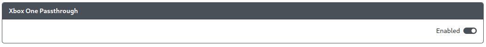

import InstallUSBHostPort from "../snippets/_add-usb-host-port.mdx";

# Xbox One Passthrough

Purpose: This add-on is intended to provide support for Xbox One and Xbox Series consoles on a GP2040 controller through the use of a passthrough authentication device attached to a USB host port.

## Web Configurator Options

:::info GPIO Pin Assignment

The Data, 5V Enable, and Pin Orientation options for USB host ports are now configured in [`Configuration > Peripheral Mapping - USB Host`](../web-configurator/menu-pages/03-peripheral-mapping.mdx#usb-host).

:::

:::caution

If you have Xbox One Passthrough enabled, you use the [`Xbox One`](../usage.mdx#input-modes) input mode in order to utilize this add-on.

:::

## Hardware

### Requirements

This add-on requires that you have a USB host port available on your device connected to GPIO pins on the RP2040 board. There are a number of methods to do so.

See [USB Host Port Installation](../controller-build/usb-host.mdx) for more information on the requirements for adding a USB host port to your controller.

### Installation

<InstallUSBHostPort />

## Miscellaneous Notes

This add-on is not compatible with the [PS4 Mode](./ps-passthrough.mdx) add-on. In order to use one, the other must be disabled.
