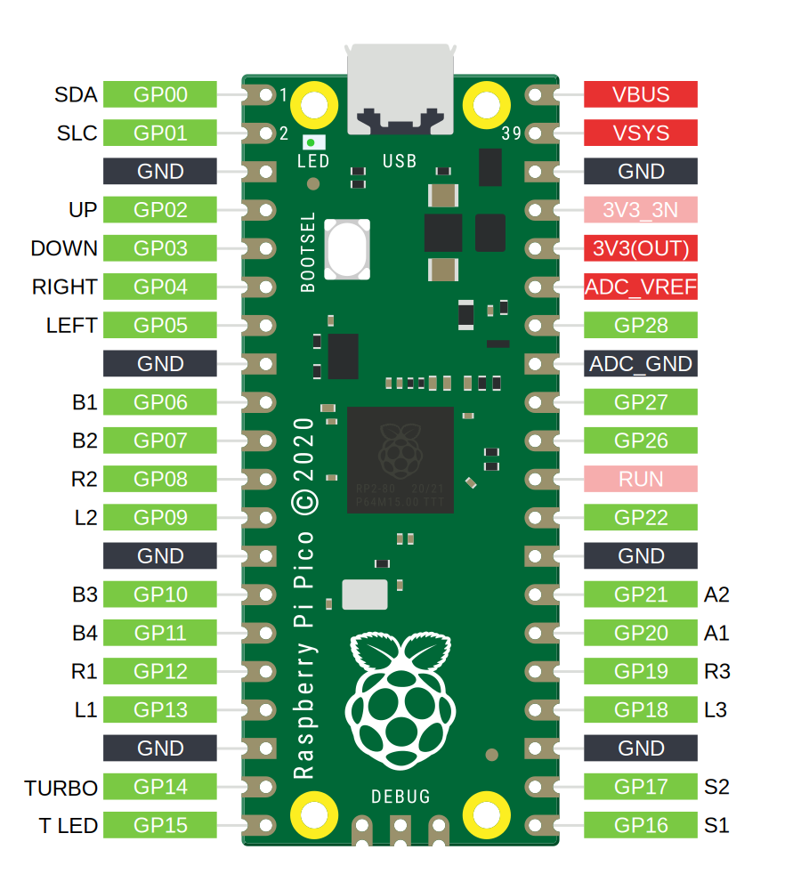
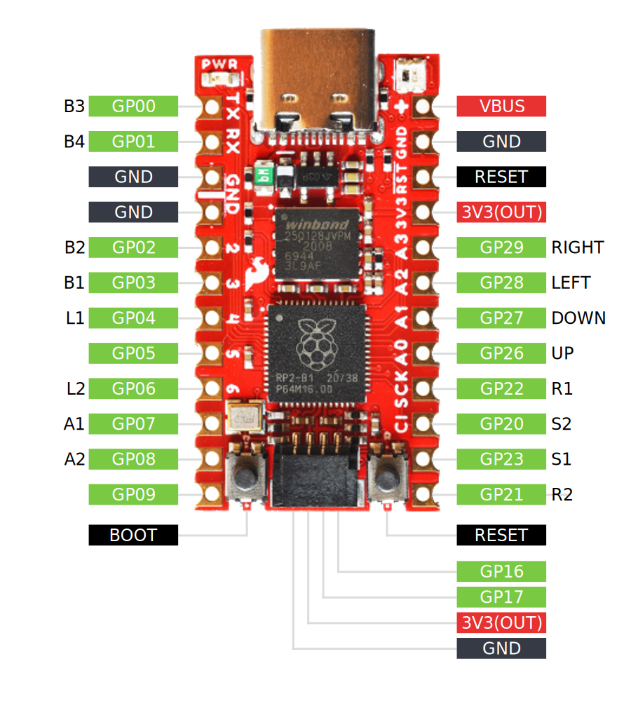
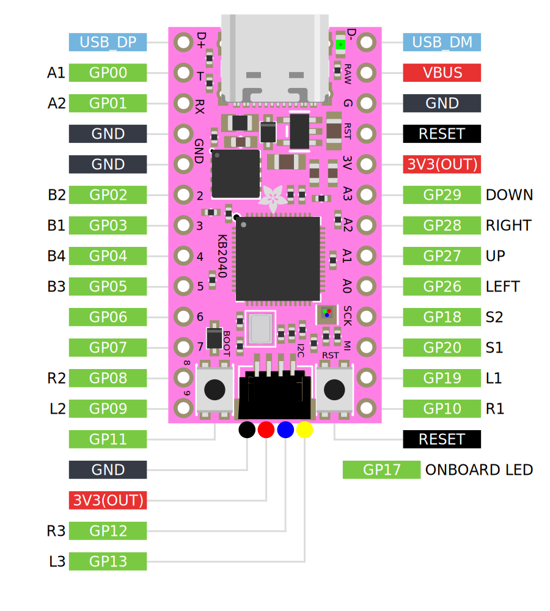

# Wiring

:::caution

Custom builds using these microcontroller boards may have different pin mappings from the ones listed below, depending on the vendor.

Resetting through the Web Configurator may result in incorrect pin mappings so it is recommended to speak with the vendor first.

:::

These are the pinouts of the GP2040-CE supported microcontroller board that are precompiled and available for [download](./downloads).

They do not cover all cases and your particular RP2040 based board will likely had a different pin out, which depends entirely on how the board manufacturer decided to make the board. Exercise caution and do not assume that the pins on your board match the ones listed here.

:::note Reconfigure GPIO Pin Out

None of these pinouts are permanent. The pinouts can be changed to suit your needs through the [Web Configurator - Pin Mapping](../web-configurator/menu-pages/02-pin-mapping.mdx).

:::

## Raspberry Pi Pico

:::info Alternative Pico Boards and Clones

The Raspberry Pi Pico pinout can also be used on clone boards with the same form factor and pinout, such as the Pimironi Pico LiPo and the Waveshare RP2040-Plus.

:::

## SparkFun Pro Micro - RP2040

## Waveshare RP2040-Zero

## Adafruit KB2040

