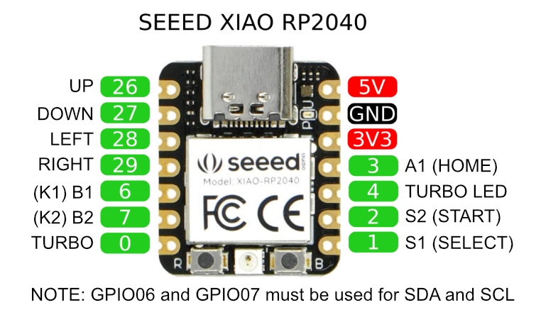
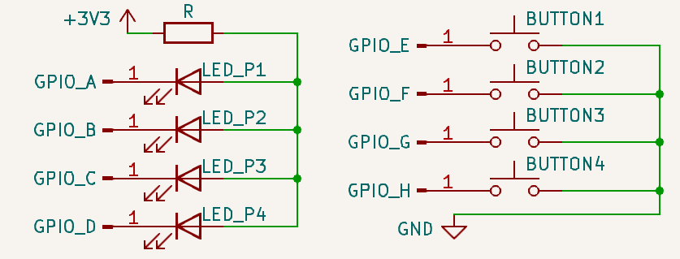

# Wiring

:::caution

Custom builds using these microcontroller boards may have different GPIO pin mappings from the ones listed below, depending on the vendor.

Resetting through the Web Configurator may result in incorrect GPIO pin mappings so it is recommended to speak with the vendor first.

:::

These are the pinouts of the GP2040-CE supported microcontroller board that are precompiled and available for [download](/downloads).

They do not cover all cases and your particular RP2040 based board will likely had a different pin out, which depends entirely on how the board manufacturer decided to make the board. Exercise caution and do not assume that the pins on your board match the ones listed here.

:::note Reconfigure GPIO Pin Out

None of these pinouts are permanent. The pinouts can be changed to suit your needs through the [Web Configurator - GPIO Pin Mapping](../web-configurator/menu-pages/02-gpio-pin-mapping.mdx).

:::

## Raspberry Pi Pico

:::info Alternative Pico Boards and Clones

The Raspberry Pi Pico pinout can also be used on clone boards with the same form factor and pinout, such as the Pimironi Pico LiPo and the Waveshare RP2040-Plus.

:::

## SparkFun Pro Micro - RP2040

## Waveshare RP2040-Zero

## Adafruit KB2040

## Seeed XIAO RP2040

# LEDs and buttons

GP2040-CE cofigures the input GPIO pins to be pulled up, expecting the button to short the pin to the ground when pressed.

The PWM player LED pins are configured similarly: the pin is shorted to the ground when active and pulled up otherwise. This means the LED anodes must be connected to the +3.3V output of the microcontroller and each cathode to its GPIO pin, in an arrangement called common anode. A current-limiting resistor must be inserted into the circuit to protect the GPIO pins; use a online calculator to compute its minimum value if unsure. The maximum safe current is cca 20mA.

