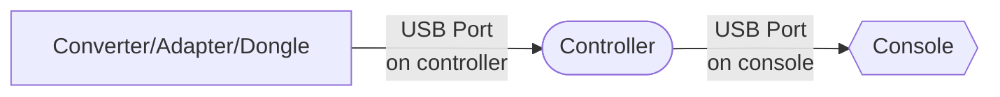
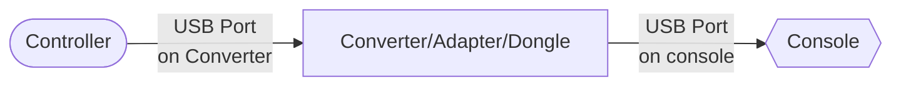

import Tabs from "@theme/Tabs";
import TabItem from "@theme/TabItem";

# FAQ: Console Compatibility

GP2040-CE supports a wide variety of consoles and the most common questions regarding console compatibility are listed below.

## General

### Is there additional latency when using the Host USB authentication for PS4, PS5, and Xbox One?

As long as Host USB authentication is configured correctly and the passthrough authentication device is properly plugged into the controller, there should be no additional latency. The passthrough authentication device is used solely for authentication without processing inputs and inputs come directly from the GP2040-CE firmware.

### How do I plug in my passthrough authentication device for PS4, PS5, and Xbox One Input Modes?

When using converters and adapters with PS4, PS5, and Xbox One Input Modes, you plug the device directly into the controller through a USB host port. You do not plug anything else into the converter/adapter.

 

:::caution Incorrect Usage of Converters/Adapters with Passthrough Add-ons

Many users incorrectly plug their controllers into the converters/adapters and then plug the converter/adapter into the console. This is not how passthrough authentication is intended to be used and will result in additional latency as inputs are processed by the converter/adapter.

Do not plug the converter/adapter as shown below.

:::

## Playstation

### Why does my controller stop responding after a while on PS4 or PS5?

PlayStation 4 and PlayStation 5 use an authentication mechanism to ensure only authorized controllers are used on the console. If a device doesn't implement this authentication mechanism, the controller is subject to an 8-minute timeout.

Using PS4 Input Mode on a PC does not result in any timeout behavior, but note that XInput is the suggested mode on PC for best compatibility.

### What is the 8-Minute Timeout?

The 8-minute timeout works like this:

1. Plug your controller into the PS4/5
2. Press the PS button to initialize the controller
3. Play for roughly 8 minutes
4. Console rejects the controller due to failed authentication
5. User unplugs their non-functional controller
6. Go back to step 1 and repeat

### How do I avoid the 8-Minute Timeout?

GP2040-CE provides multiple methods for you to avoid the 8-Minute Timeout. The recommended method will depend on whether you are using your controller on Playstation 4 or Playstation 5.

For PS4, you can either use the [PS4 Input Mode](../web-configurator/menu-pages/01-settings.mdx#additional-ps4-settings) or the [PS5 Input Mode](../web-configurator/menu-pages/01-settings.mdx#additional-ps5-settings).

For PS5 you can **only** use the [PS5 Input Mode](../web-configurator/menu-pages/01-settings.mdx#additional-ps5-settings).

### How do I get my GP2040-CE unit to work on a Playstation 4 or Playstation 5?

For Playstation 4 compatibility, you will need to use either the [PS4 Input Mode](../web-configurator/menu-pages/01-settings.mdx#additional-ps4-settings) or the [PS5 Input Mode](../web-configurator/menu-pages/01-settings.mdx#additional-ps5-settings).

For Playstation 5 compatibility, you **cannot** use the [PS4 Input Mode](../web-configurator/menu-pages/01-settings.mdx#additional-ps4-settings). You will need to use the [PS5 Input Mode](../web-configurator/menu-pages/01-settings.mdx#additional-ps5-settings)

### What is the PS4 Input Mode?

The PS4 Input Mode is an input mode that grants GP2040-CE compatibility with the Playstation 4 console. You can either use uploaded key files or a Host USB port with a passthrough authentication device to bypass the 8-minute Timeout.

<Tabs groupId="authentication-settings" defaultValue="host-usb">

<TabItem value="upload-key-file" label="Uploaded Key File" default>

- `Private Key (PEM)` - Choose your PEM file.
- `Serial Number (16 Bytes in Hex Ascii)` - Choose your serial number file.
- `Signature (256 Bytes in Binary)` - Choose your signature file.

It was built using the efforts of another open source firmware project named [Passing Link](https://github.com/passinglink/passinglink). The team behind Passing Link are in no way affiliated with the GP2040-CE project, however the work and information they've made available was greatly appreciated so we could bring this highly-requested feature to our users.

For more information, refer to [PS4 Input Mode](../web-configurator/menu-pages/01-settings.mdx#additional-ps4-settings) in the `Web Configurator - Settings` section of the documentation.

</TabItem>

<TabItem value="host-usb" label="Host USB" default>

:::note Additional Hardware Required

- [USB Host Port](../controller-build/usb-host.mdx)
- PS4/PS5 Authentication Device

:::

In order to use this setting, a USB Peripheral must be configured in [Web Configurator > Peripheral Mapping > USB Host](../web-configurator/menu-pages/03-peripheral-mapping.mdx#usb-host).

Once the USB Peripheral is configured, you need to plug in the dongle, converter, or categorized licensed PS4 controller into the USB A port on your GP2040-CE device.

</TabItem>
</Tabs>

#### How do I get the necessary keys and files for the PS4 Input Mode - Uploaded Key File?

The GP2040-CE project will not provide **_any_** files or information related to acquiring these keys and files.

:::danger

**Do not ask via any of communication channels (e.g. social media, direct messages, Github Issues, GP2040-CE Discord) as this will result in a permanent blacklist/ban.**

:::

### What is the PS5 Input Mode?

PS5 Input Mode is an input mode that grants GP2040-CE compatibility with the Playstation 4 or Playstation 5 console by using another controller or dongle to answer authentication.

<Tabs groupId="authentication-settings" defaultValue="host-usb">

<TabItem value="host-usb" label="Host USB" default>

:::note Additional Hardware Required

- [USB Host Port](../controller-build/usb-host.mdx)
- PS4/PS5 Authentication Device

:::

In order to use this setting, a USB Peripheral must be configured in [Web Configurator > Peripheral Mapping > USB Host](../web-configurator/menu-pages/03-peripheral-mapping.mdx#usb-host).

Once the USB Peripheral is configured, you need to plug in the dongle, converter, or categorized licensed PS4 controller into the USB A port on your GP2040-CE device.

</TabItem>
</Tabs>

For more information, refer to [PS5 Input Mode](../web-configurator/menu-pages/01-settings.mdx#additional-ps5-settings) in the `Web Configurator - Settings` section of the documentation.

#### What controller or dongle do I use for Host USB with PS4 and PS5 Input Modes?

:::note

The list of devices is shared between PS4 and PS5 as the controller is authenticating as a licensed, "categorized" PS4 controller. If it works for PS5, it will work for PS4 as well.

:::

There are a number of devices that the PS5 recognizes as a "categorized" controller (e.g. arcade stick, racing wheel, flight sim joystick, etc.) where the developer of the game has supported the use of "categorized" controllers. These devices have the `NXP7105` chips that allow them to authenticate with PS5 consoles.

Any USB device that works as a categorized PS4 controller (arcade stick/racing wheel/flight sim joystick) or a USB dongle that allows a controller to authenticate should work with PS Passthrough. Note that this functionality is not present in all games, but is common in fighting games and racing simulators.

Some devices that do work for PS5 include, but are not limited to;

- [MagicBoots FPS Adapter Joystick Converter for PS4 v1.1](https://www.mayflash.com/product/MAGPS4.html)
- [N5 for PXN Game Steering Wheel](https://pxn-game.com/products/n5-for-pxn-game-steering-wheel)
- Licensed PS4 Arcade Sticks

Because your experience and purchased products may vary, GP2040-CE will not provide additional specific recommendations beyond these known working devices.

:::caution Incompatible Controllers

The following controllers are not supported at all with the PS4 and PS5 Input Modes

- DualShock 4
- DualSense
- DualSense Edge
- Other licensed PS5 controllers

:::

#### How do I know the PS4 or PS5 Input Mode is working?

If you're using an OLED display,

- **PS4 Input Mode** - The displayed input mode will change from `PS4` to `PS4:AS` to indicate your device has successfully authenticated with the PS4 console
- **PS5 Input Mode**- the input mode will change from `PS5` to `PS5:AS` to indicate your device has successfully authenticated with the PS4 console

Otherwise the common option is to plug the controller into a PS4 or PS5 and wait 8 minutes to verify that the controller is still responding afterwards.

:::info

For the MagicBoots Adapter and N5 listed above, there is an indicator light on the dongle that should flash on boot and then become solid after a moment. If the indicator light is on and solid, your controllers _should_ be compatible with PS5 at that point and not time out.

:::

#### Can I remove the PS4/PS5 authentication device once I have plugged in my controller?

Playstation consoles repeatedly send authorization requests every 30 seconds or so. If the request fails (i.e. there is no passthrough authentication device plugged in), in about 8 minutes, the controller will stop responding. Once this happens, the only option is to either reset the controller or unplug and then plug the controller back into the console.

## Xbox 360

### How do I get my GP2040-CE unit to work on an Xbox 360?

For Xbox 360 compatibility, you will need to use the [XInput](../web-configurator/menu-pages/01-settings.mdx). XInput mode will change to Xbox 360 automatically when an appropriate Xbox 360 dongle is connected.

### What is the Xbox 360 Input Mode?

:::caution Additional Hardware Required

- [USB Host Port](../controller-build/usb-host.mdx)
- Xbox 360 Authentication Device

:::

Xbox 360 Mode through XInput grants GP2040-CE compatibility with the Xbox 360 by using a dongle to answer authentication

For more information, refer to [Xbox 360 Input Mode](../web-configurator/menu-pages/01-settings.mdx) in the `Web Configurator - Add-ons` section of the documentation.

### What dongle do I use for Xbox 360 Input Mode?

Currently there is only one dongle that will work for Xbox 360 input mode:

- [MagicBoots FPS Adapter Joystick Converter for Xbox 360](https://www.mayflash.com/product/MAG360.html)

Because your experience and purchased products may vary, GP2040-CE will not provide additional specific recommendations beyond these known working devices.

:::caution Xbox 360 Controllers

Xbox 360 Wireless Controllers, Xbox 360 Wired Controllers, and other licensed Xbox 360 controllers will not work with this add-on.

:::

### How do I know the Xbox 360 Input Mode add-on is working?

Because of the numerous devices to be used for passthrough authentication, there is not just one way to verify that the input mode is working without plugging the controller into a console and attempting to use it.

For the MagicBoots Adapter listed above, there is an indicator light on the dongle that should flash on boot and then become solid after a moment. If the indicator light is on and solid, your controllers _should_ be compatible and you may use your controller as intended.

### Can I remove the Xbox 360 authentication device once I have plugged in my controller?

Xbox 360 consoles only perform the authentication process once when the controller is plugged into the console. Once this occurs, the passthrough authentication device can be removed. However, it is still recommended to keep the device plugged in.

## Xbox One, Xbox Series S, and Xbox Series X

### How do I get my GP2040-CE unit to work on a Xbox One, Xbox Series S, or Xbox Series X?

For Xbox One, Xbox Series S, or Xbox Series X compatibility, you will need to use the [Xbox One Input Mode](../web-configurator/menu-pages/01-settings.mdx#additional-xbox-one-settings)

### What is the Xbox One Input Mode?

:::caution Additional Hardware Required

- [USB Host Port](../controller-build/usb-host.mdx)
- Xbox One Authentication Device

:::

Xbox One Input Mode grants GP2040-CE compatibility with the Xbox One, Xbox Series S, or Xbox Series X by using another controller or dongle to answer authentication

For more information, refer to [Xbox One Input Mode](../web-configurator/menu-pages/01-settings.mdx#additional-xbox-one-settings) in the `Web Configurator - Add-ons` section of the documentation.

### What controller or dongle do I use for Xbox One Input Mode?

Some devices that do work for Xbox One Input Mode are currently limited to the following;

- [MagicBoots FPS Adapter Joystick Converter for Xbox One](https://www.mayflash.com/product/MAGONE.html)
- [Magic-X Wireless Bluetooth USB Adapter](https://www.mayflash.com/product/magic_x.html)

Because your experience and purchased products may vary, GP2040-CE will not provide additional specific recommendations beyond these known working devices.

:::caution Xbox One Controllers

Xbox Wireless Controllers, Xbox One Elite Controllers, and other licensed Xbox One controllers will not work with this add-on.

:::

### How do I know the Xbox One Input Mode add-on is working?

Because of the numerous devices to be used for passthrough authentication, there is not just one way to verify that the input mode is working without plugging the controller into a console and attempting to use it.

For the MagicBoots Adapter listed above, there is an indicator light on the dongle that should flash on boot and then become solid after a moment. If the indicator light is on and solid, your controllers _should_ be compatible and you may use your controller as intended.

For the Magic-X Adapter listed above, there is an indicator light on the dongle that will continue flashing after the controller boots, unlike the MagicBoots Adapter.

### Can I remove the Xbox One authentication device once I have plugged in my controller?

Xbox One, Xbox Series S, and Xbox Series X consoles only perform the authentication process once when the controller is plugged into the console. Once this occurs, the passthrough authentication device can be removed. However, it is still recommended to keep the device plugged in.

## Experimental USB Hub Support

As of v0.7.10 GP2040-CE now includes experimental support for USB hubs which will allow you to connect multiple dongles along with a keyboard at the same time. Please note the following cautions.

:::caution Not all USB hubs are supported

Please note that USB hub support is still very experimental and as such we cannot provide a list of known good USB hubs.

:::

:::caution Be mindful of power draw

A USB hub and multiple connected USB dongles may add considerable load to your setups overall power draw.

:::

:::caution USB Hub Support and the RP2040 Advanced Breakout Board

Through testing we have found that on the RP2040 Advanced Breakout Board it is recommended to disable RGB LEDs via web-config if you are planning to use a USB hub. RGB LEDs can be disabled by changing the GPIO pin to `-1` and saving.

:::
