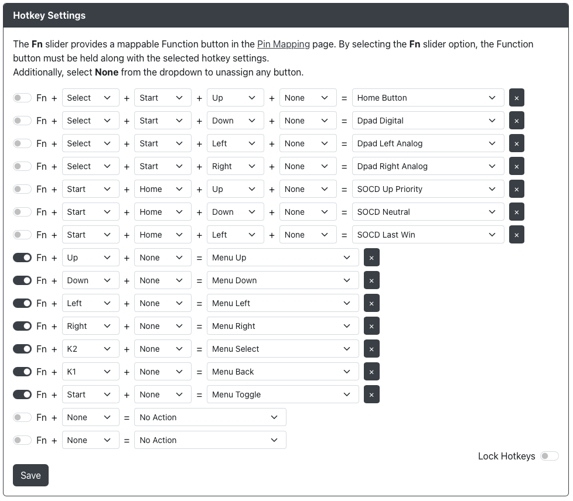

import InputLabelSelector, {
  Hotkey,
} from "@site/src/components/LabelSelector.tsx";

# GP2040-CE Mini Menu

Select the button labels to be displayed in the usage guide:

<InputLabelSelector />
 

:::note

In order to use the Mini Menu you must have a connected OLED display. Most devices will need special configuration in web-config to allow use of the Mini Menu.

:::

## Setting up the Mini Menu

In order to set up the Mini Menu you will need either spare GPIO pins for dedicated Mini Menu controls or the ability to add controls via hotkeys.

There are 7 total inputs that you can assign for the Mini Menu:

-`Menu Up` - Will navigate `up` in the Mini Menu.
-`Menu Down` - Will navigate `down` in the Mini Menu.
-`Menu Left` - Will navigate `left` in the Mini Menu.
-`Menu Right` - Will navigate `right` in the Mini Menu.
-`Menu Select` - Will `select` or move forward in the Mini Menu.
-`Menu Back` - Will move `back` in the Mini Menu.
-`Menu Toggle` - Will `toggle` the Mini Menu on or off.

On most builds it is recommended to add a `FN` button and have a function layer for navigating the Mini Menu.

## Options in the Mini Menu

-`Input Mode` - Allows you to change `input mode` to any of our supported modes.
-`D-Pad Mode` - Allows you to change the `D-Pad mode` between `D-Pad`, `Left Analog` and `Right Analog`.
-`SOCD Mode` - Allows you to change the `SOCD mode` between `Up Priority`, `Neutral`, `Last Win`, `First Win` and, where possible, `Off`.
-`Profile` - Allows you to choose a profile if you have multiple `profiles` set.
-`Focus Mode` - Allows you to enable or disable `Focus Mode`.
-`Turbo` - Allows you to enable or disable `Turbo`.
-`Exit` - Allows you to `Save & Exit` or just `Exit` the Mini Menu. Choosing to `Exit` will not save any changes made.

:::note

Please note that accidentally hitting the assigned `Menu Back` button while still in the Mini Menu and having made unsaved changes will bring up a new screen.

You will be warned that:
"Config has changed. Would you like to save"

You can choose `Yes` or `No`.

:::