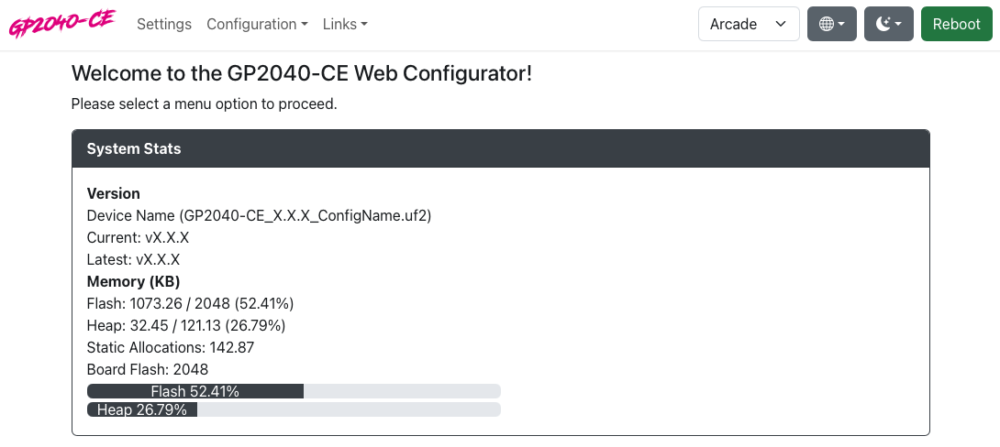

# Web Configurator - Home

Here you can see the system stats for your device.

## Version
`Device Name` - This will tell you the name of the device as well as the name of the UF2 that was placed onto the unit. 
`Current` - The current version of the firmware that is running on the device. 
`Latest` - The latest available version of the firmware in our release section. 
`Architecture` - The architecture of the current build. 
`Build Type` - This will tell you what kind of build this is. 
`Build` - This will tell you the commit that this build came from. 

## Memory
This section shows various stats about your flash memory module.

:::note

GP2040-CE requires a device with a minimum of 2mb flash (as is standard for the Raspberry Pi Pico).

There have been a small number of reports of very low cost clone devices from places like AliExpress that only come with 1mb of flash.

Devices with only 1mb of flash should be avoided as they may not work or may not work as intended.

If you are making your own device please ensure that you use at least a 2mb flash module.

:::