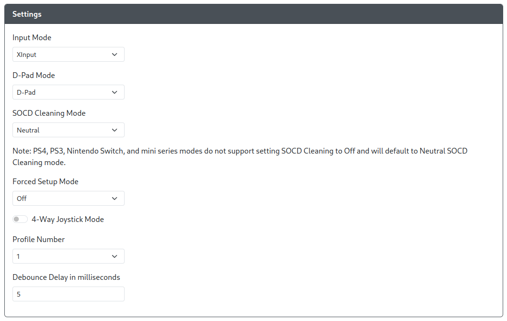
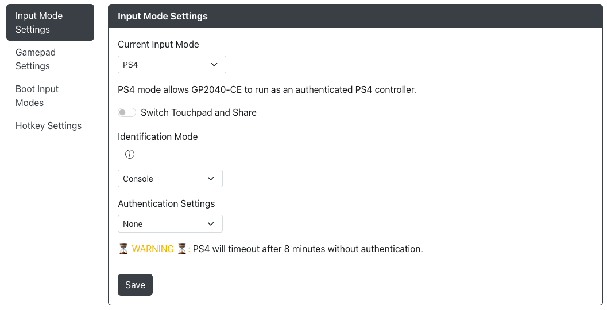
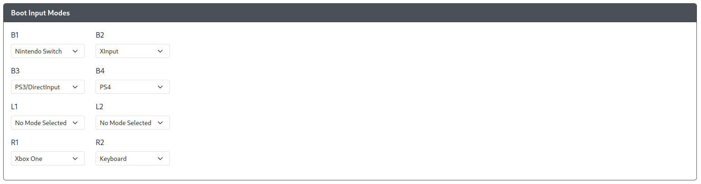

# Settings

Here you can select the basic settings which are normally available via hotkeys.

- `Input Mode` - Choose the main input mode (XINPUT, DINPUT, Switch, PS4, HID-Keyboard) this connected device will boot into when powered on. This selection will persist through unplug and plugging back in the controller.
- `D-Pad Mode` - Choose the default D-Pad mode (D-Pad, Left Stick or Right Stick).
- `SOCD Cleaning Mode` - Choose the default SOCD Cleaning Mode (Neutral, Last Win, First Win, OFF). Please note that PS4, PS3 and Nintendo Switch modes do not support setting SOCD to off and will default to Neutral SOCD.
- `Forced Setup Mode` - Allows you to lock out Input Mode, the ability to enter Web-Config or both. Enabling a web-config lockout will require you to nuke and reload the firmware if you wish to make further changes.
- `4-Way Joystick Mode` - Enables 4-Way Joystick mode which will prevent non-cardinal directions from registering. When a second cardinal direction input is received, the gamepad direction will change to the newest cardinal direction, similar to [SOCD Last Win](../../hotkeys.mdx#socd-last-win).
- `Profile Number` - Enables different GPIO pin mappings per profile. Changeable through the Web-Config or [hotkeys](../../hotkeys.mdx#load-profile--1-4).
- `Debounce Delay in milliseconds` - Timeframe where the firmware will ignore additional inputs to prevent switch noise from accidentally triggering unintended inputs.

## Additional PS4 Settings

- `Switch Touchpad and Share` - Share will now be mapped to A2 rather than S1, Touchpad will be now mapped to S1 rather than A2
- `PS4 Report Speed Hack` - Disables report counters in the PS4/PS5 reports. This decreases PS4/PS5 latency, but is known to have instability in small number of games. Disable this setting if you are encountering stuck inputs.
- ` Controller Mode` - Choose what PS4 mode the device will use, either `Controller` or `Arcade Stick`.
  - `Controller` - The device will function as a native PS4 controller. Primarily intended for use with the [PS4 Mode](../../add-ons/ps4-mode.mdx) add-on and will require the various files be uploaded onto the controller to properly function and avoid the [8-Minute Timeout](../../faq/faq-console-compatibility.mdx#what-is-the-8-minute-timeout).
  - `Arcade Stick` - The device will function as a licensed PS4 arcade stick, provided that an authentication device is connected and the PS Passthrough add-on is enabled and properly configured. It will also work for the PS5 UI, any PS4 games on the PS5 as well as PS5 titles that support legacy controllers.

:::info

If you wish to play compatible PS5 games, you will need to choose `Arcade Stick` and thus have an authentication device connected and the PS Passthrough add-on enabled and properly configured via a USB passthrough port.

:::

## Boot Input Modes

For each of the buttons listed in the menu, you can assign a different input mode to enter while holding that button during boot (e.g. when plugging in the controller or immediately after resetting the controller).

For the list of input modes to select from, see [Input Modes](../../usage.mdx#input-modes).

## Hotkey Settings

An arbitrary number of buttons and directions, plus the optional Function (Fn) button, can be used to define desired hotkey actions. Select `Fn` if desired, plus one or more buttons/directions, and associate them with a hotkey action. The default hotkeys can be modified or removed, and new ones added, up to 12 in total.

The available hotkey actions will expand over time. We may also expand the number of hotkeys available to configure in the future. For a list of the available hotkey actions, see [Hotkeys](../../hotkeys.mdx).
