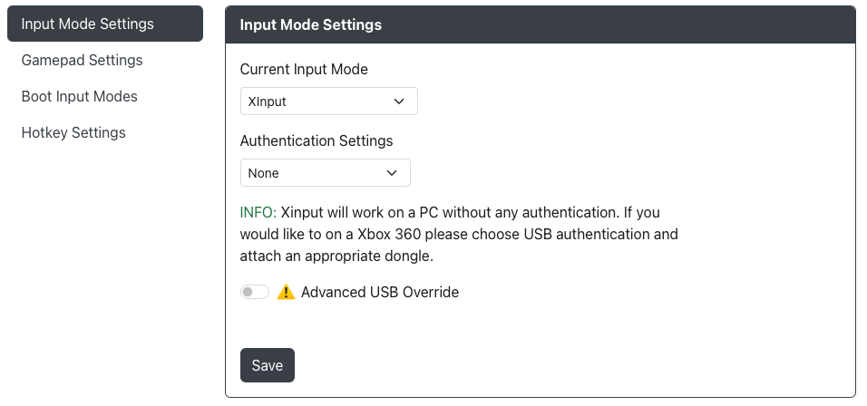
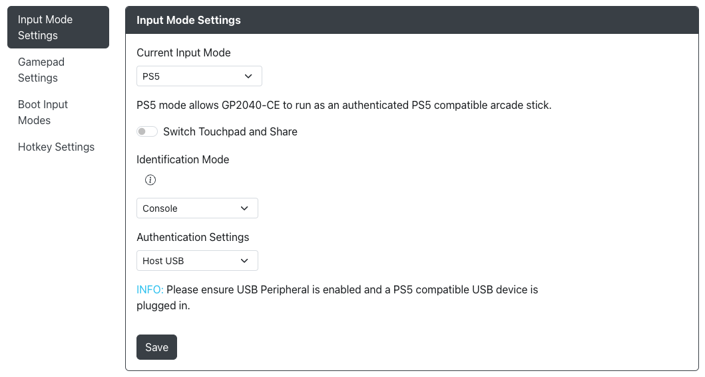
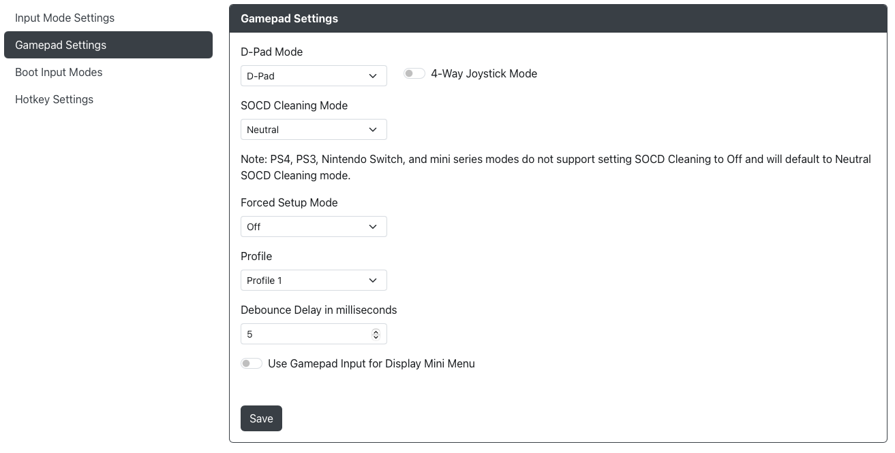
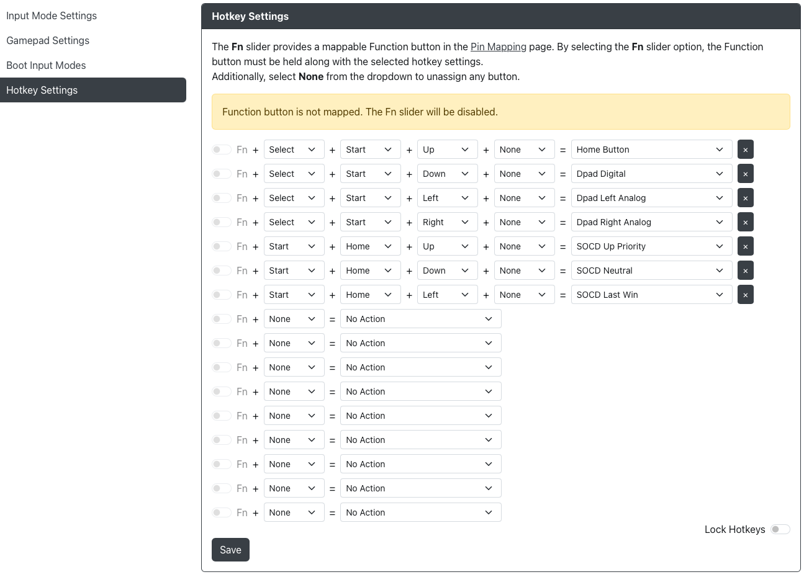

import Tabs from "@theme/Tabs";
import TabItem from "@theme/TabItem";

# Settings

## Input Mode Settings

- `Current Input Mode` - Choose the main input mode (XINPUT, DINPUT, Switch, PS4, HID-Keyboard, etc.) this connected device will boot into when powered on. This selection will persist through unplug and plugging back in the controller.
- `Authentication Settings` - Choose a method of authentication if needed for the mode.

:::note

Xinput will work on a PC without any authentication. If you would like to on a Xbox 360 please choose USB authentication and attach an appropriate dongle.

:::

GP2040-CE allows you to override some of the USB descriptor information.  These settings should only be changed if you know what you are doing.

- 'Product Name` - How you would like the name of the device to come up in your device list
- 'Manufacturer` - How you would like the manufacturer to come up in the device details
- `Version` - What version you would like to assign to the device details

There is an additional layer of USB device information that can be changed under `Override Physical IDs`.  

- `Vendor ID` - A vendor ID descriptor
- `Product ID` - A product ID descriptor

::warning

Please note that changing and of the options in either the `Advanced USB Override` or the `Override Physical IDs` may cause the input mode to no longer function.  

The GP2040-CE team offers no support on issues that arrise from changing these settings.  

:::

### Keyboard Mapping

Here you can remap the GP2040-CE buttons to different keyboard keycodes that will be sent to the PC or game console when pressed in Keyboard Mode.

### Additional PS4 Settings

- `Switch Touchpad and Share` - Share will now be mapped to A2 rather than S1, Touchpad will be now mapped to S1 rather than A2
- `Identification Mode` is an option to allow for situations where a true DualShock 4 would be required. This doesn't make it a real DS4 for technical reasons, but it does make the firmware behave more like one.  
  - `Console` - This is what everyone is used to. It works on PS4/PS5 with the same restrictions you would expect for authorization.
  - `Remote/Emulation` - This is used in situations where the only controller you can use is a DualShock 4, but doesn't necessarily require any sort of passthrough authorization.  PS Remote Play only allows "authentic" DualShock 4/DualSense controllers, but does not (currently) seem to require auth.  Open PS2 Loader (OPL) versions with the PADEMU USB controller driver will only look for "authentic" DualShock 3/4 controllers, but do not require auth to function.
When playing directly on a PS4/PS5 console, using Console mode will allow the controller to behave as expected.  This is the default.  When using Remote/Emulation directly on a console, the controller will not be detected for technical reasons.
When playing via PS Remote Play specifically, since Console mode does not appear as an authentic DualShock 4 controller, it will not be detected.  Using an alternate Remote Play client, such as Chiaki, does not have this limitation.
Unless something changes specifically in PS Remote Play, authorization is not required in Remote/Emulation mode.
- `Authentication Settings`
  - `Uploaded Key File` - Upload key files obtained from a Dualshock 4 to authenticate and bypass the PS4's 8-minute time out
  - `Host USB` - Use a dongle, converter, or licensed PS4 controller to authenticate your GP2040-CE device

<Tabs groupId="authentication-settings" defaultValue="host-usb">

<TabItem value="upload-key-file" label="Uploaded Key File" default>

- `Uploaded Key File`
  - `Private Key (PEM)` - Choose your PEM file.
  - `Serial Number (16 Bytes in Hex Ascii)` - Choose your serial number file.
  - `Signature (256 Bytes in Binary)` - Choose your signature file.

:::danger Warning

The GP2040-CE project will not provide any files or information related to acquiring these keys and files under any circumstances.

Do not ask via any of communication channels (e.g. social media, direct messages, Github Issues, GP2040-CE Discord) as this will result in a permanent blacklist/ban.

:::

</TabItem>

<TabItem value="host-usb" label="Host USB" default>

In order to use this setting, a USB Peripheral must be configured in [Web Configurator > Peripheral Mapping > USB Host](./03-peripheral-mapping.mdx#usb-host)

</TabItem>
</Tabs>

### Additional PS5 Settings

- `Switch Touchpad and Share` - Share will now be mapped to A2 rather than S1, Touchpad will be now mapped to S1 rather than A2
- `Identification Mode` is an option to allow for situations where a true DualShock 4 would be required. This doesn't make it a real DS4 for technical reasons, but it does make the firmware behave more like one.  
  - `Console` - This is what everyone is used to. It works on PS4/PS5 with the same restrictions you would expect for authorization.
  - `Remote/Emulation` - This is used in situations where the only controller you can use is a DualShock 4, but doesn't necessarily require any sort of passthrough authorization.  PS Remote Play only allows "authentic" DualShock 4/DualSense controllers, but does not (currently) seem to require auth.  Open PS2 Loader (OPL) versions with the PADEMU USB controller driver will only look for "authentic" DualShock 3/4 controllers, but do not require auth to function.
When playing directly on a PS4/PS5 console, using Console mode will allow the controller to behave as expected.  This is the default.  When using Remote/Emulation directly on a console, the controller will not be detected for technical reasons.
When playing via PS Remote Play specifically, since Console mode does not appear as an authentic DualShock 4 controller, it will not be detected.  Using an alternate Remote Play client, such as Chiaki, does not have this limitation.
Unless something changes specifically in PS Remote Play, authorization is not required in Remote/Emulation mode.
- `Authentication Settings`
  - `Host USB` - Use a dongle, converter, or licensed PS4 controller to authenticate your GP2040-CE device

<Tabs groupId="authentication-settings" defaultValue="host-usb">
<TabItem value="host-usb" label="Host USB" default>

In order to use this setting, a USB Peripheral must be configured in [Web Configurator > Peripheral Mapping > USB Host](./03-peripheral-mapping.mdx#usb-host)

</TabItem>
</Tabs>

### Additional Xbox One Settings

In order to use this setting, a USB Peripheral must be configured in [Web Configurator > Peripheral Mapping > USB Host](./03-peripheral-mapping.mdx#usb-host)

### Experimental USB Hub Support

GP2040-CE now has experimental support for USB hubs.  A USB hub will now let you connect multiple authentication dongles as well as a keyboard.

There are no settings to change for USB hub support, it is simply plug and play.  

As an example, you could have the following connected to a USB hub:
1 - USB keyboard
2 - Mayflash MagicBoots PS4 v1.1 dongle
3 - Mayflash MagicBoots Xbox 1 dongle
4 - Mayflash MagicBoots Xbox 360 dongle

So long as the USB hub is compatible this combination should let switch between PS5 / Xbox / Xbox360 mode without physically switching the dongles around.

This will also, for the first time, allow you to use a keyboard in PS5 / Xbox / Xbox360 mode (without authentication issues so long as an appropriate dongle is used).

:::caution

USB Hub Support is currently experimental.  We do not recommend that it be used for commercial applications.

We do not guarantee that any combination of devices and hubs will work and we will not accept support tickets or GitHub issues about combinations that do not work at this time.

We have seen issues with some USB hubs.  We do not guarantee that any single hub will or will not work and we have no plans to introduce a list of known good hubs.

We have also seen issues with some dongles when added to a USB hub setup like the Mayflash Magic-X.  When the Mayflash Magic-X is added to a USB hub it may not work as intended and also may cause other dongles not to work as intended. 

We leave it to the user to explore various combinations and see what works and does not work for them.

Please be mindful of power draw if you are adding multiple dongles and a USB hub to devices and setups that use LEDs.  If you are finding issues with your setup try turning off LEDs.

:::

## Gamepad Settings

- `D-Pad Mode` - Choose the default D-Pad mode (D-Pad, Left Stick or Right Stick).
- `SOCD Cleaning Mode` - Choose the default SOCD Cleaning Mode (Neutral, Last Win, First Win, OFF). Please note that PS4, PS3 and Nintendo Switch modes do not support setting SOCD to off and will default to Neutral SOCD.
- `Forced Setup Mode` - Allows you to lock out Input Mode, the ability to enter Web-Config or both. Enabling a web-config lockout will require you to nuke and reload the firmware if you wish to make further changes.
- `4-Way Joystick Mode` - Enables 4-Way Joystick mode which will prevent non-cardinal directions from registering. When a second cardinal direction input is received, the gamepad direction will change to the newest cardinal direction, similar to [SOCD Last Win](../../hotkeys.mdx#socd-last-win).
- `Profile Number` - Enables different GPIO pin mappings per profile. Changeable through the Web-Config or [hotkeys](../../hotkeys.mdx#load-profile-1-4).
- `Debounce Delay in milliseconds` - Timeframe where the firmware will ignore additional inputs to prevent switch noise from accidentally triggering unintended inputs.
- `Use Gamepad Input for Display Mini Menu` - Allows direction inputs as well as buttons to control the `Mini Menu`.

:::note

Please note that if `Use Gamepad Input for Display Mini Menu` is enabled inputs will still be sent to the device while navigating the `Mini Menu`.

As an example, pressing down to go to the next `Mini Menu` item will also send the down input in-game.

:::

## Boot Input Modes

For each of the buttons listed in the menu, you can assign a different input mode to enter while holding that button during boot (e.g. when plugging in the controller or immediately after resetting the controller).

For the list of input modes to select from, see [Input Modes](../../usage.mdx#input-modes).

## Hotkey Settings

Hotkeys allow for combinations of buttons to be pressed to produce other actions or inputs.

By default, 16 total `Hotkeys` can be assigned.

Although there are 7 default `Hotkeys` in the firmware, individual board configurations may have more or less and the standard `Hotkeys` may be different. 

When the `FN` key is not mapped you will not be able to enable the `FN` slider.  The `FN` slider will require the `FN` button to be pressed along with the other specified buttons to trigger the `Hotkey`.

:::note

Please note that a greyed out `FN` slider does not mean a `Hotkey` is not active.  A greyed out `FN` slider means that an `FN` button has not been assigned.  

You will see a warning at the top of the page if no `FN` button has been assigned.

:::

The available hotkey actions will expand over time. We may also expand the number of hotkeys available to configure in the future. For a list of the available hotkey actions, see [Hotkeys](../../hotkeys.mdx).

At the end of each set `Hotkey` line you will see a `X` button.  Pressing this will remove the `Hotkey`.  You are free to remove the default `Hotkeys` if you do not wish to have them as well.

There is also an option at the bottom to `Lock Hotkeys` which will cause all `Hotkeys` to stop working.