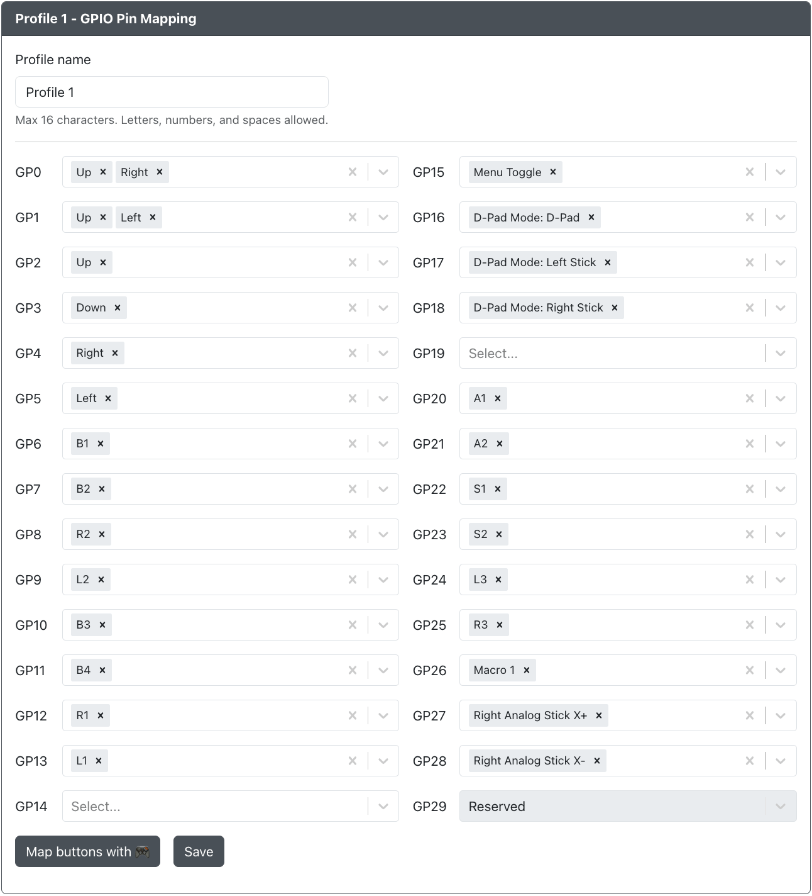
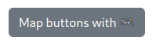
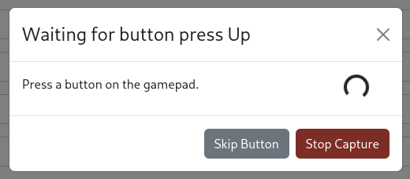

# Pin Mapping

Here you can remap the GP2040-CE buttons to different GPIO pins on the RP2040 chip. This can be used to simply remap buttons or bypass a GPIO pin that may have issues on your device.

The following options are available for assignment to each GPIO Pin.

- Standard Gamepad inputs found in [Buttons](../../usage.mdx#buttons)
- [Dual Direction Input](../../add-ons/dual-direction-input.mdx) Up, Down, Left and Right
- [D-Pad Mode](../../add-ons/joystick-selection-slider.mdx): Digital, Left Stick, and Right Stick
- [Up Priority SOCD Cleaning](../../hotkeys.mdx#socd-up-priority)
- [Neutral SOCD Cleaning](../../hotkeys.mdx#socd-neutral)
- [Last Win SOCD Cleaning](../../hotkeys.mdx#socd-last-win)
- [First Wins SOCD Cleaning](../../hotkeys.mdx#socd-first-wins)
- [SOCD Cleaning Off](../../hotkeys.mdx#socd-cleaning-off)
- [Turbo](../../add-ons/turbo.mdx)

:::note

Options are not limited to a single GPIO pin assignment and can be assigned multiple times (e.g. GPIO pins 0-29 can all be assigned to Up, if desired).

:::

## Pin Viewer :video_game:

This tool is available to see what GPIO pin is physically wired to a button. Click on the button and follow the prompt. It will ask you to press the button and then display a "Pressed pin".

## Map Buttons With :video_game:

If you do not know what pins are mapped to which button on your device, there is a tool available to help. Click on the button shown above and follow the prompt. It will ask you to press each standard gamepad input found in [Buttons](../../usage.mdx#buttons) one at a time.

- If you do not wish to map a specific input, you can click `Skip Button` and proceed.
- If you do not need to map any more inputs, click `Stop Capture`.

## Copy Base Profile

This tool is available to copy the GPIO pin assignments from the base profile. Once they are copied, you can make any additional changes to the pin assignments for that profile.

## Profiles

You can configure profiles that will change the GPIO to GP2040-CE button mappings based on what profile number you have set. This means that you can have button layouts for different use cases and change between them without the need to enter the Web Configurator and remap GPIO pins.

The profile number either using the Web Configurator on the [Settings page](../../web-configurator/menu-pages/01-settings.mdx) or using a [hotkey shortcut](../../hotkeys.mdx#load-profile-1-4). There is not a default input combination associated with these `Load Profile #1-4` hotkey shortcuts so you will likely need to set them up in the Settings page under [Hotkey Settings](../../web-configurator/menu-pages/01-settings.mdx#hotkey-settings).

:::info

At this time, profiles are limited to changing GPIO pin assignment can cannot be used to change other settings and add-ons that are not directly related to GPIO pin assignment and available to set. This includes, but is not limited to, settings and add-ons such as

- Boot Input Modes
- Hotkeys
- Peripheral Mapping
- Keyboard Mapping Assignments
- Tilt Input
- Wii Extension
- SNES Extension
- Focus Mode
- Keyboard Host Button-to-Key mapping

:::
