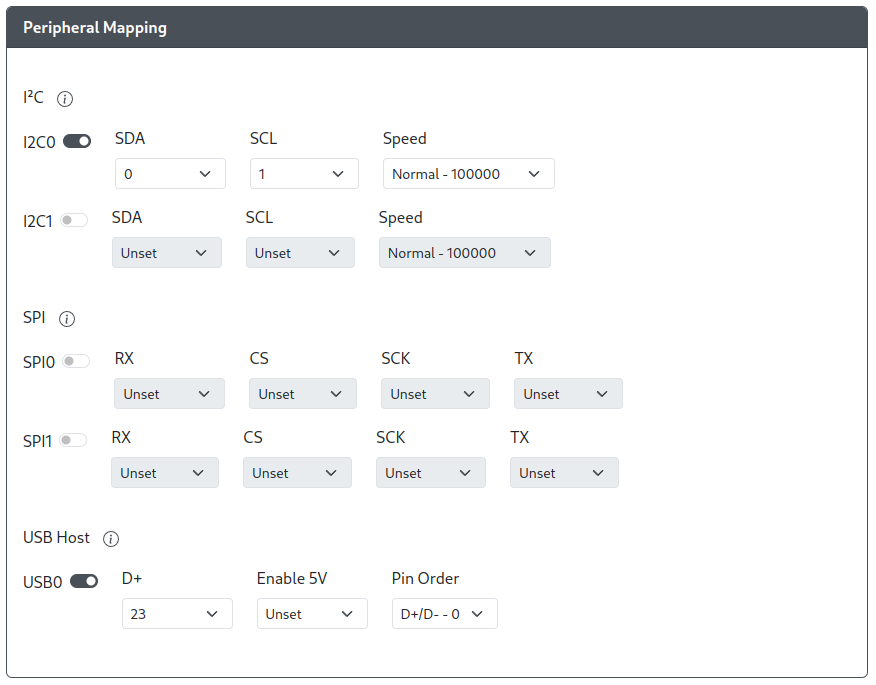

import I2CTable from "../../snippets/_i2c-block-table.mdx";
import SPITable from "../../snippets/_spi-block-table.mdx";

# Peripheral Mapping

Here you can assign the GPIO pins necessary for using input modes, peripherals, and add-ons that require I2C and a USB host port. These include, but are not limited to

- [PS4 Input Mode](../web-configurator/menu-pages/01-settings.mdx#additional-ps4-settings)
- [PS5 Input Mode](../web-configurator/menu-pages/01-settings.mdx#additional-ps5-settings)
- [OLED Display](./07-display-configuration.mdx)
- [I2C Analog ADS1219](../../add-ons/i2c-analog-ads1219.mdx)
- [Xbox One Input Mode](./01-settings.mdx#additional-xbox-one-settings)
- [Keyboard Host Add-on](../../add-ons/keyboard-host.mdx)

:::info

Click on the (i) tool tip in the Web Configurator for more information on the various settings

:::

## I2C

Each I2C block, `I2C0` and `I2C1`, has separate settings and each must be configured before using the respective I2C block. These must be configured properly before any feature or add-on that uses I2C can be used.

- `Toggle` - This will toggle a specific I2C block on and off
- `SDA` - The GPIO pin used for Serial Data (SDA).
- `SCL` - The GPIO pin used for Serial clock (SCL).
- `Speed` - Sets the speed of I2C communication.
  - `Normal - 100000`
  - `Fast - 400000`
  - `Fast Plus - 800000`

:::caution

The SDA and SCL pins must match a pair found on the table below for each I2C block. If this is not configured correctly, your I2C devices will not function properly.

:::

<I2CTable />

## SPI

Each SPI block, SPI0 and SPI1, has separate settings and must be configured before using the respective SPI block. These must be configured properly before any feature or add-on that uses SPI can be used.

- `Toggle` - This will toggle a specific SPI block on and off
- `RX` - The GPIO pin used for MISO, to receive data.
- `CS` - The GPIO pin used for Chip Select (CS).
- `SCK` - The GPIO pin used for Serial Clock (SCK).
- `TX` - The GPIO pin used for MOSI, to send data.

:::caution

The pins must match a set found on the table below for each SPI block. If this is not configured correctly, your SPI devices will not function properly.

:::

<SPITable />

## USB Host

There are not restrictions on which GPIO pins can be used for setting up a USB host port. You can pick any GPIO pin as long as it is available (not being used by any other feature) and the GPIO pin selected for `D+` has a GPIO pin immediately following or preceding it that can be used for `D-` (e.g. GPIO X and GPIO X+/-1).

- `Toggle` - This will toggle the USB Host Port on and off
- `D+` - The GPIO Pin used to carry Data Plus between the USB Host Port and RP2040
- `Enable 5V` - The GPIO Pin used to enable 5V power to the host port on the board.
- `Pin Order` - This setting is based on the order that the Data pins are connected to sequential GPIO pins
  - `D+/D-` - The GPIO pins are set such that, sequentially, `D+` is immediately followed by `D-` (e.g. D+ = 0. D- = 1)
  - `D-/D+` -The GPIO pins are set such that, sequentially, `D+` is immediately preceded by `D-` (e.g. D+ = 29, D- = 28)

:::note Enable 5V

Most boards do not require this to be set. This is only applicable to a small number of boards (e.g. Adafruit RP2040 Feather USB Host) as they possess pins for enabling and disabling 5V port on the USB host port.

:::
