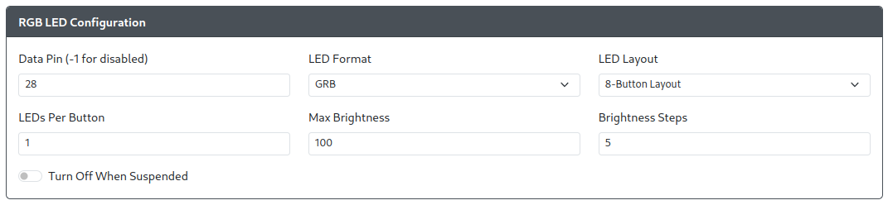
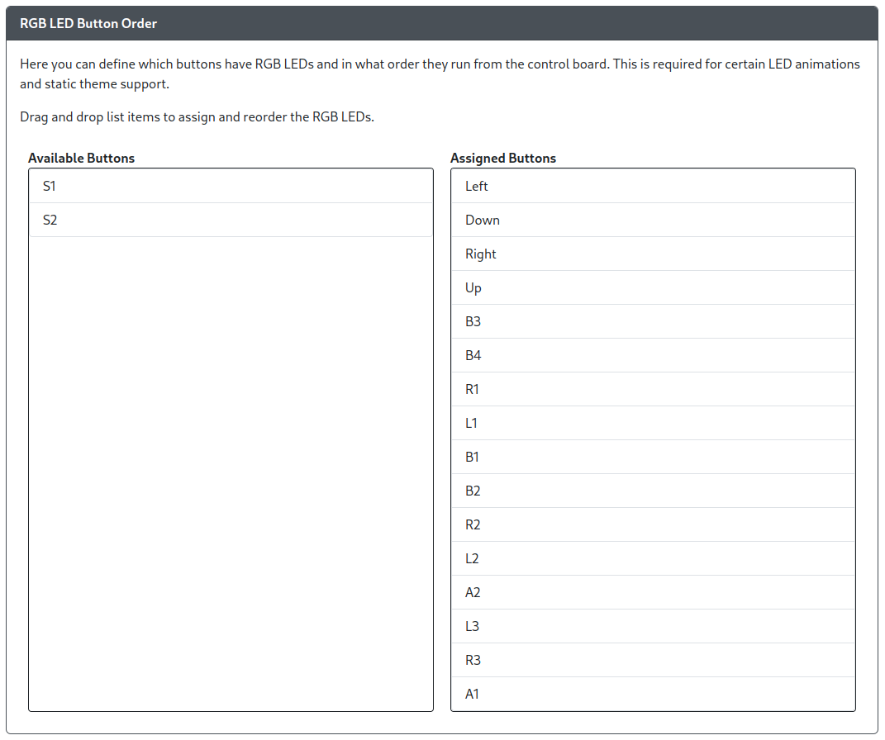
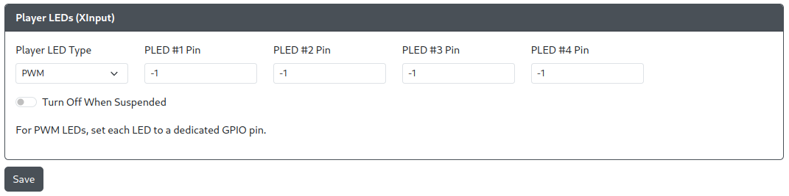
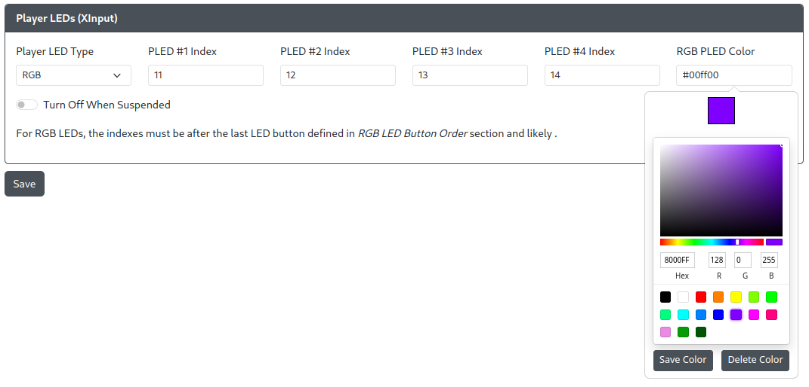
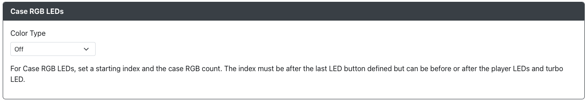
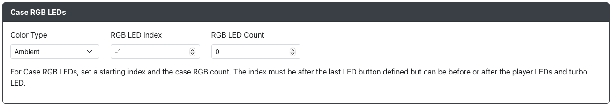

# LED Configuration

If you have a setup with per-button RGB LEDs, they can be configured here.

## RGB LED Configuration

- `Data Pin` - The GPIO pin that will drive the data line for your RGB LED chain. Set to `-1` to disable RGB LEDs.
- `LED Format` - The data format used to communicate with your RGB LEDs. If unsure the default `GRB` value is usually safe.
- `LED Layout` - Select the layout for your controls/buttons. This is used for static themes and some per-button animations.
- `LEDs Per Button` - Set the number of LEDs in each button on your chain.
- `Max Brightness` - Set the maximum brightness for the LEDs. Ranges from 0-255.
- `Brightness Steps` - The number of levels of brightness to cycle through when turning brightness up and down.

## RGB LED Button Order

:::note

Please note that RGB Button LEDs must be the first LEDs configured. They will start at index 0 on the RGB LED strip.

Also, at the current time, each button can only have one instance in the LED chain. This is the case even if multiple LEDs are assigned per button and multiple buttons are assigned to different GPIO pins.

:::

Rearrange the Buttons in the order of the LED Chain. This is different between devices and is determined by manufacturer of the board and LEDs.

## Player LEDs (XInput)

Available selections for `Player LED Type` are `None`, `PWM` or `RGB`.

### PWM Player LEDs

- `PLED #[1-4] Pin` - The GPIO pin the standard LED is connected to.

### RGB Player LEDs

:::note

Please note that RGB Player LEDs must be located at an index after the RGB LED Buttons on the LED strip! The Web Config interface will suggest a starting index based on the number of LED buttons mapped in [RGB LED Button Order](#rgb-led-button-order) and the select `LEDs Per Button` value. We hope to remove this limitation in the future.

:::

- `PLED #[1-4] Index` - The index of the LED module on the RGB strip.
- `RGB PLED Color` - Click the box to reveal a color picker, or manually enter the color.

### Case RGB LEDs

Case RGB LEDs allow you to add additional RGB LEDs inside of your case or on your device for more RGB goodness.

There are several options for `Color Type`:
- `Off` - No case RGB LEDs
- `Ambient` - Case RGB LEDs will operate independently of your button LED settings.
- `Linked` - Case RGB LEDs will match the button LED settings.

:::note

When in `Ambient` case RGB LED mode you will have access to some additional shortcuts to change the LEDs.

`Start` + `P1` + `K1` = Cycle between `Ambient`, `Linked`, and `Off` mode.
`Start` + `P2` = Increase brightness of case LEDs
`Start` + `K2` = Decrease brightness of case LEDs
`Start` + `P3` = Next color for static colors in case LEDs
`Start` + `K3` = Previous color for static colors in case LEDs
`Start` + `P4` = Next Effect in Ambient mode
`Start` + `K4` = Previous Effect in Ambient mode

:::

When choosing `Ambient` or `Linked` modes you will also need to specify where the case LEDs start in the index as well as how many LEDs are to be used for case LEDs.
- `RGB LED Index` - The LED position in the chain to start case RGB LEDs at.
- `RGB LED Count` - The number of LEDs that will be used for case RGB LEDs.

:::note

The index must be after the last LED button defined but can be before or after the player LEDs and turbo LED.

:::