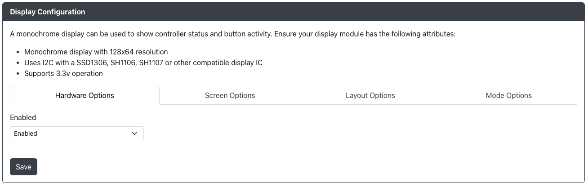

# Display Configuration

GP2040-CE supports the use of a display module such as an OLED with a SSD1306, SH1106, or SH1107 display IC.

## Hardware Options

- `Enabled` - Turns on/off the display module.

## Screen Options

- `Flip Display` - Allows you to flip or mirror the display in a variety of ways.
- `Invert Display` - Inverts the pixel colors, effectively giving you a negative image when enabled.
- `Power Management` - Allows you to turn off the display when suspended.

## Layout Options

:::note Button Layout Combinations

Be sure to pick left and right layouts that match. Some layout combinations result in overlapping buttons on the screen.

:::

## Button Layout

- `Button Layout (Left)` - Changes the onscreen layout for the left side of the display and stick.
- `Button Layout (Right)` - Changes the onscreen layout for the right side of the display and stick.
- `Button Layout Orientation` - Allows you to flip or switch the overall layout.

## Status Bar Layout

- `Input Mode` - Allows you to show or hide the `Input Mode` on your display.
- `Turbo` - Allows you to show or hide the `Turbo` setting on your display.
- `D-Pad Mode` - Allows you to show or hide the `D-Pad Mode` on your display.
- `SOCD Mode` - Allows you to show or hide the `SOCD Mode` on your display.
- `Macro Mode` - Allows you to show or hide the `Macro Mode` on your display.
- `Profile` - Allows you to show or hide the `Profile` pop-up on your display (if profiles are enabled).

## Input History Layout

- `Input History` - Allows you to show or hide a a running input history.

Input history has the following options:
- `History length (characters)` - The number of characters to display on the screen for `Input History` (21 by default).
- `Column` - The column position on the screen to start `Input History` at (0 by default).
- `Row` - The row position on the screen to start `Input History` at (7 by default).

:::note

It is recommended to leave `History length (characters)`, `Column` and `Row` as they are unless you are working on a custom display.

:::

## Mode Options

- `Splash Mode` - Enables or disables a splash screen displaying when the unit is turned on.
- `Splash Duration` - Sets the amount of time the splash screen displays for on boot.
- `Display Saver Timeout` - Will cause the display to turn off after the specified number of minutes. Pressing any input will cause the display to turn back on.
- `Choose File` - Upload your own image to be used for the splash screen.

## Custom Splash Screen

It is recommend that you use a two color 128x64 image (or one that is sized appropriately for your display). Uploading any other type of image will result in a conversion and sizing of the image automatically.

Supported Formats: BMP, GIF, JPG, JPEG, PNG, WEBP

:::caution

Animated GIFs are not supported at this time.

:::

Check out our collection of great custom splash screens from the community [HERE](../community-splash-screens.mdx)

## Display Elements

This area contains an explanation of display elements and provide an example for how it may appear on your device.

### Top Row

Going from left to right, the display elements are

- [Input Mode](../../usage.mdx#input-modes) - Displays the current input mode
  - `XINPUT` - XInput
  - `SWITCH` - Nintendo Switch
  - `DINPUT` - PS3/DirectInput
  - `HID-KB` - Keyboard
  - `PS4` - Controller Mode set as `Controller`, will change to `PS4:AS` on successful authentication
  - `PS4:AS` - [PS4 Input Mode](../../web-configurator/menu-pages/01-settings.mdx#additional-ps4-settings) add-on successfully authenticated
  - `PS5` - Controller Mode Set as `Arcade Stick`, will change to `PS5:AS` on successful authentication
  - `PS5:AS` - [PS5 Input Mode](../../web-configurator/menu-pages/01-settings.mdx#additional-ps5-settings) add-on successfully authenticated
  - `XBONE` - Xbox One compatible with [Xbox One Input Mode](./01-settings.mdx#additional-xbox-one-settings)
  - `OGXBOX` - Original XBox
  - `GEN/MD` - Sega Genesis/MegaDrive Mini
  - `NGMINI` - NEOGEO mini
  - `PCE/TG` - PC Engine/Turbografx 16 Mini
  - `EGRET` - EGRET II Mini
  - `ASTRO` - ASTROCITY Mini
  - `PSC` - Playstation Classic
- [Turbo](../../add-ons/turbo.mdx) - Will display `T##` when Turbo is enabled where ## is the number of presses per second
- DPad Mode - Displays the current DPad Mode
  - `D` - [DPad Digital](../../hotkeys.mdx#dpad-digital)
  - `L` - [DPad Left Analog](../../hotkeys.mdx#dpad-left-analog)
  - `R` - [DPad Right Analog](../../hotkeys.mdx#dpad-right-analog)
- SOCD Cleaning Mode - Displays the current SOCD cleaning Mode
  - `SOCD-U` - [SOCD Up Priority](../../hotkeys.mdx#socd-up-priority)
  - `SOCD-N` - [SOCD Neutral](../../hotkeys.mdx#socd-neutral)
  - `SOCD-L` - [SOCD Last Wins](../../hotkeys.mdx#socd-last-wins)
  - `SOCD-F` - [SOCD First Wins](../../hotkeys.mdx#socd-first-wins)
  - `SOCD-X` - [SOCD Cleaning Off](../../hotkeys.mdx#socd-cleaning-off)
- [Macros](./09-macros.mdx) - `M` will appear if Macros are enabled and this cannot be disabled.

### Middle

The appearance of this area will depend on the particular configuration of your [Button Layouts](#layout-options) on the Left and Right sides

- Turbo Rings - When using the Turbo Mode is enabled on individual buttons, the buttons will have a smaller inner ring as an indicator. When disabled, this button will disappear.

### Bottom

- Input History - Will display input history when the [Input History](../../add-ons/input-history.mdx) add-on is enabled and configured
