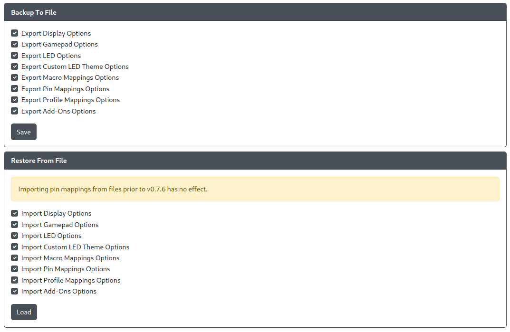

# Data Backup and Restoration

- `Backup To File` - Allows you to select what to backup to a file (default is all selected).
- `Restore From File` - Allows you to select what to restore from a file (default is all selected).

:::warning

As of GP2040-CE version 0.7.6, importing pin mappings from backups made in prior versions will have no effect. If the firmware file for your controller is available, it is recommended to [flash nuke](../../installation.mdx#flash-nuke-process) your controller and flash the GP2040-CE v0.7.6 onto your controllers.

Do note that this will wipe any and all data your controller had prior to the flash nuke process.

:::
