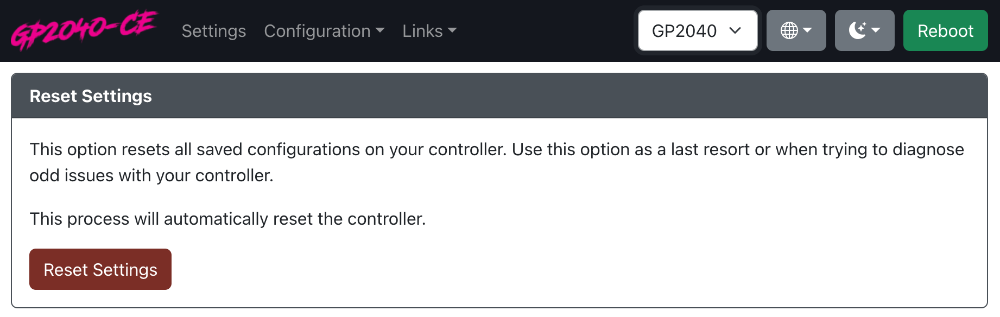

# Reset Settings

The `Reset Settings` option will reset all settings back to the original board configation settings.

:::note

Please note that if you are using a custom device that someone has made where they used a base configuration and made changes to it, this may casue features and changes on the device to no longer work.

This will likely only be the case on devices that are not hosted in our main release section.

If you have a device not listed in our main release section we recommend reaching out to the seller before doing a reset of the settings.

The GP2040-CE is unable to assist with config related issues on devices that are not part of our release section.

:::