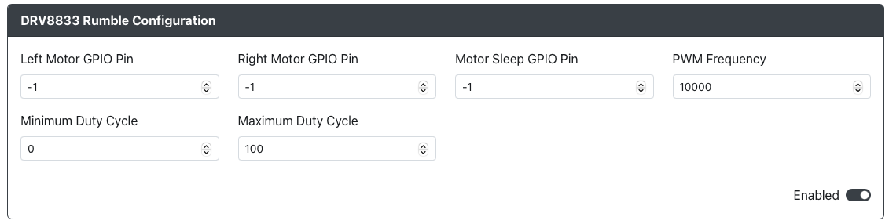

# ODRV8833 震动

用途：此附加功能允许您在 Xinput 模式下使用 DRV8833 震动功能。

## Web 配置器选项

- `Left Motor GPIO Pin` - DRV8833 上左侧电机 `AIN1` 连接的 GPIO 引脚。
- `Right Motor GPIO Pin` - DRV8833 上右侧电机 `AIN2` 连接的 GPIO 引脚。
- `Motor Sleep GPIO Pin` - DRV8833 上 `SLP` 连接的 GPIO 引脚。
- `PWM Frequency` - 电机的 PWM 频率（建议从 10,000 开始，并根据需要调整）。
- `Minimum Duty Cycle` - 0-255 震动值的最低范围百分比。
- `Maximum Duty Cycle` - 0-255 震动值的最高范围百分比。

### 要求

此附加功能需要一个 DRV8833 电机驱动器或扩展板，以及一个或两个震动电机。
