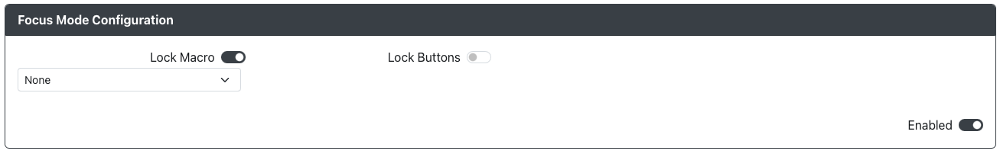

# 专注模式配置

用途：此插件旨在允许您在启用专注模式时禁用多个功能或输入，但在其他情况下仍可访问它们。

## 网页配置器选项

- `Lock Macro` - 启用后，在专注模式下宏触发将无法激活宏序列。
- `Lock Buttons` - 启用后，列出的输入在专注模式下将不会被发送。随着输入的添加，将出现新的下拉菜单以供选择更多输入。

请注意，专注模式引脚可以在主 GPIO 引脚映射页面上设置。

## 硬件

### 要求

设置为 `Focus Mode Pin` 的 GPIO 引脚需要保持低电平以保持专注模式的激活。需要使用拨动开关、滑动开关或锁定开关以正确使用此插件。

### 安装

安装方式取决于使用的是拨动开关、滑动开关还是锁定开关。通常情况下，将开关的一侧连接到设置为 `Focus Mode Pin` 的 GPIO 引脚。将开关的另一侧或如果有 3 个触点则连接中心触点到任何 GND 引脚。

## 其他注意事项

无。
