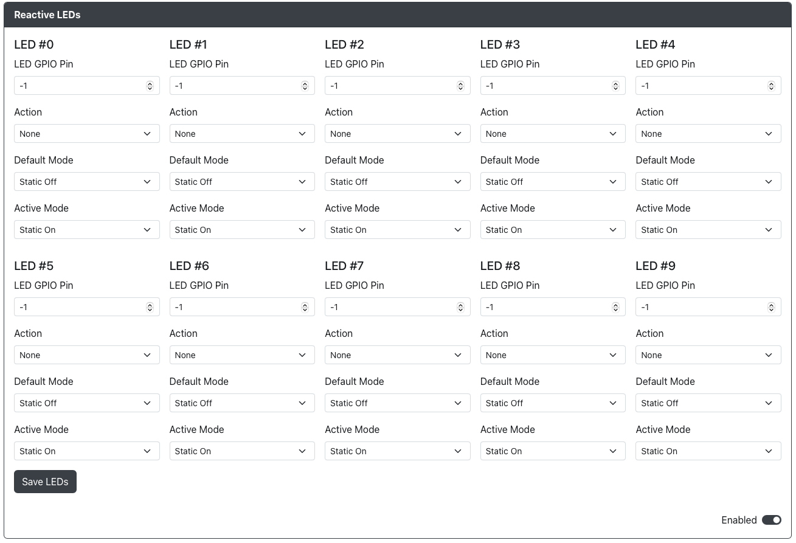

# 响应式 LEDs 配置

用途：此插件允许您设置连接到 GPIO 的单色反应式 LED。

## 网页配置器选项

通过 网页配置器总共可以配置 10 个 LED。对于每个 LED，您可以进行以下设置：

LED X  
- `LED GPIO Pin` - LED 连接到的 GPIO 引脚。  
- `Action` - 选择触发此 LED 的操作。  
- `Default Mode` - 选择在未启用此操作时的行为。  
- `Active Mode` - 选择在启用此操作时的行为。  

## 硬件

您需要将 LED 连接到 GPIO 引脚和接地（GND）。
