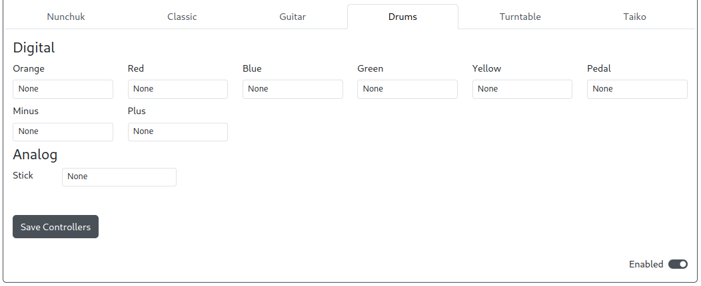

import Tabs from "@theme/Tabs";
import TabItem from "@theme/TabItem";
import InputTable from "../snippets/_input-table.mdx";

# Wii 扩展

用途：此插件旨在允许您使用各种 Wii 控制器（例如 Nunchuck、经典 Wii 控制器、吉他、鼓、转盘和太鼓）与 GP2040-CE 配合使用，以支持 GP2040-CE 支持的系统。

:::note

Wii 扩展插件不适用于 Wii 游戏机。

:::

## 网页配置器选项

:::info GPIO 引脚分配

I2C 的 SDA 和 SCL 引脚及其速度现在在 [`Configuration > Peripheral Mapping - I2C`](../web-configurator/menu-pages/03-peripheral-mapping.mdx#i2c) 中配置。

:::

- `I2C Block` - 要使用的 I2C 块（i2c0 或 i2c1）。

### 控制器特定选项

<Tabs groupId="wii-extenstions" defaultValue="Nunchuck">
<TabItem value="Nunchuck" label="Nunchuck" default>

</TabItem>
<TabItem value="Classic" label="Classic" default>

:::note

- 经典控制器支持包括经典、经典 Pro 和 NES/SNES Mini 控制器。
- 原版经典控制器的 L 和 R 触发器为模拟敏感型，而 Pro 型触发器则不是。

:::

</TabItem>
<TabItem value="Guitar" label="Guitar" default>

</TabItem>
<TabItem value="Drums" label="Drums" default>

:::note

由于配件硬件问题，鼓和 DJ 转盘控制器可能需要从 Nunchuk 或经典控制器热插拔后才能使用。

:::

</TabItem>
<TabItem value="Turntable" label="Turntable" default>

</TabItem>
<TabItem value="Taiko" label="Taiko" default>

</TabItem>
</Tabs>

上述每个选项均使用以下 GP2040 输入标签，用于从控制器映射到 GP2040-CE 的输入。

<InputTable />

### 要求

此插件需要某种方式将控制器连接到 GP2040-CE 设备的以下引脚。

- `PWR` - 3.3V 电源供给（可能也标记为 `+` 或 `VIN`）
- `GND` - 地线（可能也标记为 `-`）
- `SDA` - 串行数据线（可能也标记为 `C`）
- `SCL` - 串行时钟线（可能也标记为 `D`）

:::note

市面上有许多可用的扩展板，在线搜索 "Wiichuck Adapter" 会显示许多选项。

某些扩展板可能包含一个 3.3V 输出，但此插件不需要该输出即可正常工作。

:::

### 安装

根据 网页配置器中设置的 GPIO 引脚，将 Wii 控制器/适配器连接到 GP2040-CE 板。

- `PWR` - 3.3V 电源供给（可能也标记为 `+` 或 `VIN`）
- `GND` - 地线（可能也标记为 `-`）
- `SDA` - 串行数据线（可能也标记为 `C`）
- `SCL` - 串行时钟线（可能也标记为 `D`）

## 其他备注

无。
