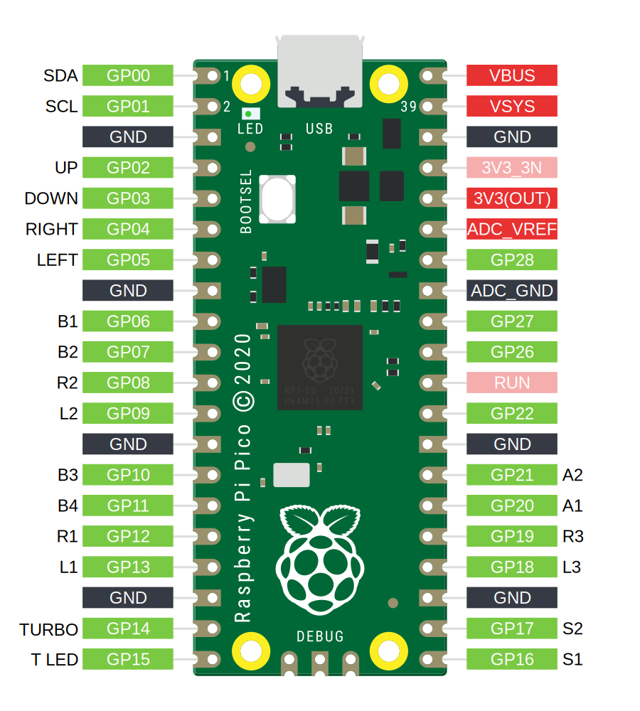

# 接线指南

:::caution

使用这些微控制器板的自定义构建可能会由于供应商不同而具有与下文列出内容不同的 GPIO 引脚映射。  
通过网页配置器重置可能导致 GPIO 引脚映射错误，建议您先与供应商沟通。

:::

以下是 GP2040-CE 支持的微控制器板的引脚分布图，这些板已预编译并可通过 [下载](/downloads) 获取。

这些引脚分布图并不涵盖所有情况，您的 RP2040 板可能具有不同的引脚分布，具体取决于板制造商的设计。请务必谨慎，不要假设您的板上的引脚与下文列出的引脚一致。

:::note 重新配置 GPIO 引脚分布

这些引脚分布并非固定不变。您可以通过 [网页配置器 - GPIO 引脚映射](../web-configurator/menu-pages/02-gpio-pin-mapping.mdx) 根据需要更改引脚分布。

:::

## 树莓派 Pico

:::info 替代的 Pico 板及其克隆版本

树莓派 Pico 的引脚分布同样适用于具有相同外形和引脚分布的克隆板，例如 Pimironi Pico LiPo 和 Waveshare RP2040-Plus。

:::

## SparkFun Pro Micro - RP2040

## Waveshare RP2040-Zero

## Adafruit KB2040

## Seeed XIAO RP2040

