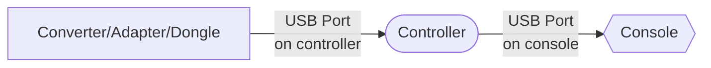
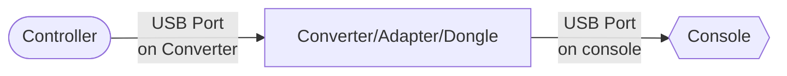

import Tabs from "@theme/Tabs";
import TabItem from "@theme/TabItem";

# FAQ: 主机兼容性

GP2040-CE 支持多种主机，以下列出关于主机兼容性的常见问题。

## 通用问题

### 使用主机 USB 认证功能（用于 PS4、PS5 和 Xbox One）是否会增加延迟？

只要主机 USB 认证正确配置且通过认证的设备正确插入控制器，就不会增加延迟。通过认证的设备仅用于认证，不处理输入，输入由 GP2040-CE 固件直接处理。

### 如何为 PS4、PS5 和 Xbox One 输入模式连接通过认证的设备？

在使用 PS4、PS5 和 Xbox One 输入模式的情况下，通过转换器或适配器将设备直接插入控制器的 USB 主机端口，而不是将其他设备连接到转换器/适配器。

 

:::caution 不正确的通过认证设备连接方式

许多用户错误地将控制器插入转换器/适配器，然后再将转换器/适配器插入主机。这种连接方式并非通过认证的预期用法，会导致转换器/适配器处理输入从而增加延迟。

请勿按如下方式进行连接：

:::

## PlayStation

### 为什么我的控制器在 PS4 或 PS5 上使用一段时间后不再响应？

PS4 和 PS5 使用认证机制确保仅限授权控制器在主机上使用。如果设备未实现该认证机制，控制器将在 8 分钟后超时。

在 PC 上使用 PS4 输入模式则不会出现超时，不过建议在 PC 上使用 XInput 模式以获得最佳兼容性。

### 什么是 8 分钟超时？

8 分钟超时机制如下：

1. 将控制器插入 PS4/5。
2. 按下 PS 按钮初始化控制器。
3. 大约 8 分钟后游戏。
4. 由于认证失败，主机拒绝控制器。
5. 用户拔下停止响应的控制器。
6. 返回第 1 步并重复上述过程。

### 如何避免 8 分钟超时？

GP2040-CE 提供多种方法避免 8 分钟超时。建议根据是否在 PS4 或 PS5 上使用控制器选择对应的方法。

- 对于 PS4，可使用 [PS4 输入模式](../web-configurator/menu-pages/01-settings.mdx#additional-ps4-settings) 或 [PS5 输入模式](../web-configurator/menu-pages/01-settings.mdx#additional-ps5-settings)。
- 对于 PS5，只能使用 [PS5 输入模式](../web-configurator/menu-pages/01-settings.mdx#additional-ps5-settings)。

### 如何让我的 GP2040-CE 设备在 PS4 或 PS5 上工作？

- **PS4**：需要使用 [PS4 输入模式](../web-configurator/menu-pages/01-settings.mdx#additional-ps4-settings) 或 [PS5 输入模式](../web-configurator/menu-pages/01-settings.mdx#additional-ps5-settings)。
- **PS5**：不能使用 [PS4 输入模式](../web-configurator/menu-pages/01-settings.mdx#additional-ps4-settings)，必须使用 [PS5 输入模式](../web-configurator/menu-pages/01-settings.mdx#additional-ps5-settings)。

### 什么是 PS4 输入模式？

PS4 输入模式是一种允许 GP2040-CE 与 PS4 主机兼容的输入模式。可以通过上传密钥文件或使用带通过认证设备的 USB 主机端口来绕过 8 分钟超时。

<Tabs groupId="authentication-settings" defaultValue="host-usb">

<TabItem value="upload-key-file" label="上传密钥文件" default>

- `私钥 (PEM)` - 选择您的 PEM 文件。
- `序列号 (16 字节十六进制 ASCII)` - 选择您的序列号文件。
- `签名 (256 字节二进制)` - 选择您的签名文件。

此功能基于另一开源固件项目 [Passing Link](https://github.com/passinglink/passinglink) 的努力构建。Passing Link 项目团队与 GP2040-CE 无关联，但感谢他们的工作和共享的信息，使我们得以为用户提供这一高需求功能。

更多信息请参阅文档中 `Web Configurator > Settings` 部分的 [PS4 输入模式](../web-configurator/menu-pages/01-settings.mdx#additional-ps4-settings)。

</TabItem>

<TabItem value="host-usb" label="主机 USB" default>

:::note 需要额外硬件

- [USB 主机端口](../controller-build/usb-host.mdx)
- PS4/PS5 认证设备

:::

为使用此设置，需要在 [Web Configurator > Peripheral Mapping > USB Host](../web-configurator/menu-pages/03-peripheral-mapping.mdx#usb-host) 中配置 USB 外围设备。

配置完成后，将加密狗、转换器，或已认证的 PS4 控制器插入 GP2040-CE 设备上的 USB A 端口。

</TabItem>
</Tabs>

#### 如何获取 PS4 输入模式所需的密钥和文件（上传密钥文件）？

GP2040-CE 项目**不会**提供**任何**关于获取这些密钥和文件的信息。

:::danger

**请勿通过任何联系方式（例如社交媒体、直接消息、Github 问题、GP2040-CE Discord）寻求帮助，否则将被永久黑名单/封禁。**

:::

### 什么是 PS5 输入模式？

PS5 输入模式是一种通过另一控制器或加密狗进行认证，从而令 GP2040-CE 与 PS4 或 PS5 主机兼容的输入模式。

<Tabs groupId="authentication-settings" defaultValue="host-usb">

<TabItem value="host-usb" label="主机 USB" default>

:::note 需要额外硬件

- [USB 主机端口](../controller-build/usb-host.mdx)
- PS4/PS5 认证设备

:::

为使用此设置，需要在 [Web Configurator > Peripheral Mapping > USB Host](../web-configurator/menu-pages/03-peripheral-mapping.mdx#usb-host) 中配置 USB 外围设备。

配置完成后，将加密狗、转换器，或已认证的 PS4 控制器插入 GP2040-CE 设备上的 USB A 端口。

</TabItem>
</Tabs>

更多信息，请参考文档中 `Web Configurator - Settings` 部分的 [PS5 输入模式](../web-configurator/menu-pages/01-settings.mdx#additional-ps5-settings)。

#### 在 PS5 和 PS4 输入模式下，我应使用什么认证设备？

:::note

PS4 和 PS5 共享设备列表，因为控制器认证为已授权的 PS4 控制器。如果适用于 PS5，那么也适用于 PS4。

:::

以下设备适用于 PS5 并且支持通过认证。这些设备搭载 `NXP7105` 芯片，可与 PS5 主机认证：

- [MagicBoots FPS Adapter Joystick Converter for PS4 v1.1](https://www.mayflash.com/product/MAGPS4.html)
- [N5 for PXN Game Steering Wheel](https://pxn-game.com/products/n5-for-pxn-game-steering-wheel)
- 授权的 PS4 街机摇杆

此功能不适用于所有游戏，但常用于格斗游戏和赛车模拟游戏。

:::caution 不兼容的控制器

以下控制器无法通过 PS4 和 PS5 输入模式识别：

- DualShock 4
- DualSense
- DualSense Edge
- 其他授权 PS5 控制器

:::

#### 如何验证 PS4 或 PS5 输入模式是否正常工作？

如果使用 OLED 显示屏：

- **PS4 输入模式**：设备成功通过 PS4 主机认证后，显示的输入模式将从 `PS4` 变为 `PS4:AS`。
- **PS5 输入模式**：设备成功通过 PS5 主机认证后，显示的输入模式将从 `PS5` 变为 `PS5:AS`。

通常的选择是将控制器插入 PS4 或 PS5，等待 8 分钟，验证控制器是否仍然响应。

:::info

对于上述的 MagicBoots 和 N5，启动时加密狗上的指示灯应闪烁一会，之后保持常亮。如果灯常亮，那么控制器应该可以正常兼容 PS5 并避免超时。

:::

#### 插入控制器后可否移除 PS4/PS5 认证设备？

PlayStation 主机每 30 秒左右重复发送认证请求。如果请求失败（即未插入通过认证设备），约 8 分钟后控制器将停止响应。一旦发生这种情况，只能通过重置控制器或重新插拔控制器恢复。

## Xbox 360

### 如何让我的 GP2040-CE 设备在 Xbox 360 上工作？

为了实现 Xbox 360 的兼容性，您需要使用 [XInput](../web-configurator/menu-pages/01-settings.mdx)。当连接适配的 Xbox 360 加密狗时，XInput 模式会自动切换到 Xbox 360 模式。

### 什么是 Xbox 360 输入模式？

:::caution 需要额外硬件

- [USB 主机端口](../controller-build/usb-host.mdx)  
- Xbox 360 验证设备  

:::

通过 XInput 的 Xbox 360 模式，GP2040-CE 可以通过加密狗实现对 Xbox 360 的兼容性，用于完成认证过程。

欲了解更多信息，请参阅文档中 “Web Configurator - Add-ons” 部分的 [Xbox 360 输入模式](../web-configurator/menu-pages/01-settings.mdx)。

### 哪种加密狗可以用于 Xbox 360 输入模式？

当前，仅有以下加密狗可用于 Xbox 360 输入模式：  
- [MagicBoots FPS Adapter Joystick Converter for Xbox 360](https://www.mayflash.com/product/MAG360.html)

由于您的体验和购买的产品可能不同，GP2040-CE 不会提供除这些已知设备以外的其他具体建议。

:::caution Xbox 360 控制器  

Xbox 360 无线控制器、Xbox 360 有线控制器和其他授权的 Xbox 360 控制器无法与此附加功能兼容。  

:::

### 如何判断 Xbox 360 输入模式附加功能是否正常工作？

由于需要使用多种设备进行传递认证，因此无法在不将控制器连接到主机并尝试使用之前，确认输入模式是否正常工作。

对于上述的 MagicBoots 加密狗，该加密狗上有一个指示灯。启动时，指示灯会闪烁，然后在片刻后变为常亮。如果指示灯亮起且保持常亮，您的控制器**应该**是兼容的，您可以正常使用控制器。

### 插入控制器后，我可以移除 Xbox 360 验证设备吗？

Xbox 360 主机在控制器插入主机时，仅会进行一次认证。一旦完成认证，传递认证设备可以移除。但建议始终将设备保持连接状态。

---

## Xbox One、Xbox Series S 和 Xbox Series X

### 如何让我的 GP2040-CE 设备在 Xbox One、Xbox Series S 或 Xbox Series X 上工作？

为了实现 Xbox One、Xbox Series S 或 Xbox Series X 的兼容性，您需要使用 [Xbox One 输入模式](../web-configurator/menu-pages/01-settings.mdx#additional-xbox-one-settings)。

### 什么是 Xbox One 输入模式？

:::caution 需要额外硬件

- [USB 主机端口](../controller-build/usb-host.mdx)  
- Xbox One 验证设备  

:::

Xbox One 输入模式允许 GP2040-CE 通过另一款控制器或加密狗完成认证，从而实现对 Xbox One、Xbox Series S 和 Xbox Series X 的兼容性。

欲了解更多信息，请参阅文档中 “Web Configurator - Add-ons” 部分的 [Xbox One 输入模式](../web-configurator/menu-pages/01-settings.mdx#additional-xbox-one-settings)。

### 哪种控制器或加密狗可用于 Xbox One 输入模式？

以下设备可用于 Xbox One 输入模式：

- [MagicBoots FPS Adapter Joystick Converter for Xbox One](https://www.mayflash.com/product/MAGONE.html)  
- [Magic-X Wireless Bluetooth USB Adapter](https://www.mayflash.com/product/magic_x.html)

由于您的体验和购买的产品可能不同，GP2040-CE 不会提供除这些已知设备以外的其他具体建议。

:::caution Xbox One 控制器

Xbox 无线控制器、Xbox One 精英控制器和其他授权的 Xbox One 控制器无法与此附加功能兼容。

:::

### 如何判断 Xbox One 输入模式附加功能是否正常工作？

由于需要使用多种设备进行传递认证，因此无法在不将控制器连接到主机并尝试使用之前，确认输入模式是否正常工作。

对于上述的 MagicBoots 加密狗，该加密狗上有一个指示灯。启动时，指示灯会闪烁，然后在片刻后变为常亮。如果指示灯亮起且保持常亮，您的控制器**应该**是兼容的，您可以正常使用控制器。

对于上述的 Magic-X 加密狗，该设备上的指示灯会持续闪烁，而不像 MagicBoots 加密狗那样保持常亮。

### 插入控制器后，我可以移除 Xbox One 验证设备吗？

Xbox One、Xbox Series S 和 Xbox Series X 主机在控制器插入主机时，仅会进行一次认证。一旦完成认证，传递认证设备可以移除。但建议始终将设备保持连接状态。

---

## 实验性 USB 集线器支持

从 v0.7.10 开始，GP2040-CE 现在包括对 USB 集线器的实验性支持，允许同时连接多个加密狗和键盘。但请注意以下警告。

:::caution 并非所有 USB 集线器均被支持  

请注意，USB 集线器支持仍在实验阶段，因此我们无法提供已知良好 USB 集线器的列表。  

:::

:::caution 注意功耗  

USB 集线器和多个连接的 USB 加密狗可能会显著增加整体配置的功耗。  

:::

:::caution USB 集线器支持与 RP2040 高级扩展板  

通过测试，我们发现如果您计划使用 USB 集线器，建议在 RP2040 高级扩展板上通过 Web 配置禁用 RGB LED。可以通过将 GPIO 引脚改为 `-1` 并保存来禁用 RGB LED。  

:::
