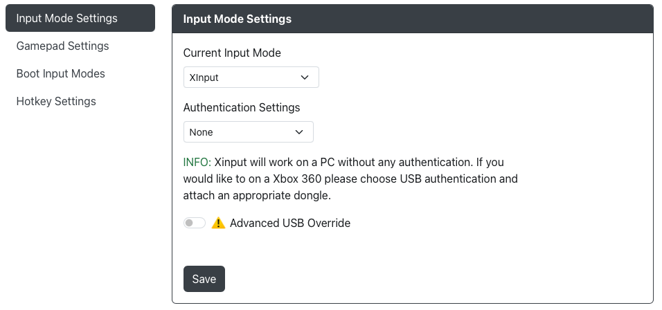
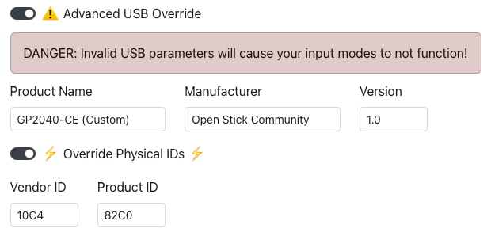
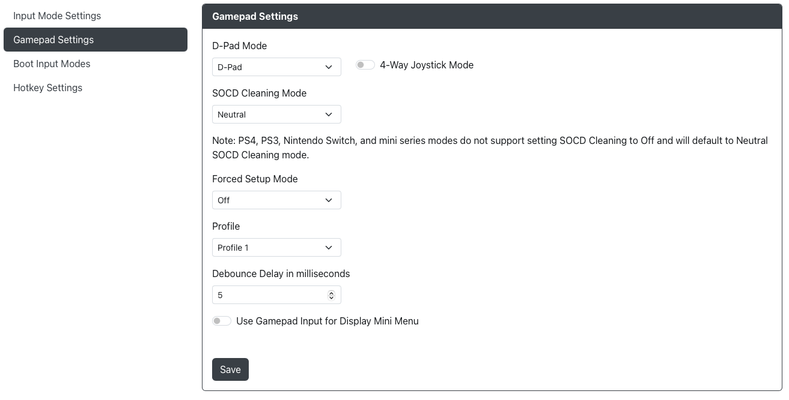

import Tabs from "@theme/Tabs";
import TabItem from "@theme/TabItem";

# 设置

## 输入模式设置

- `当前输入模式` - 选择此连接设备在通电时启动的主要输入模式（XInput、 DInput、 Switch、 PS4 、 HID-Keyboard 等）。此选择将在断开连接并重新插入控制器后保持不变。
- `认证设置` - 如果模式需要认证，请选择一种认证方法。

:::note

Xinput 在 PC 上无需任何认证即可工作。如果您希望在 Xbox 360 上使用，请选择 USB 认证并连接适当的认证设备。

:::

GP2040-CE 允许您覆盖部分 USB 描述符信息。这些设置仅在您明确知道自己在做什么时进行更改。

- `Product Name` - 您希望设备在设备列表中显示的名称
- `Manufacturer` - 您希望设备详情中显示的制造商名称
- `Version` - 您希望分配给设备详情的版本

在 `Override Physical IDs` 下还有一层额外的 USB 设备信息可以更改。

- `Vendor ID` - 供应商 ID 描述符
- `Product ID` - 产品 ID 描述符

:::warning

请注意，更改 `Advanced USB Override` 或 `Override Physical IDs` 中的任何选项可能会导致输入模式无法正常工作。

GP2040-CE 团队不对因更改这些设置而引发的问题提供支持。

:::

### 键盘映射

在此，您可以将 GP2040-CE 按钮重新映射为不同的键盘键码，当按下键盘模式时，这些键码会发送到 PC 或游戏主机。

### 额外的 PS4 设置

- `切换触摸板和分享键` - 分享键现在将映射到 A2 而不是 S1 ，触摸板现在将映射到 S1 而不是 A2 。
- `识别模式` 是一种允许在需要真正 DualShock 4 的情况下使用的选项。由于技术原因，这并不会使设备成为真正的 DS4 ，但它确实使固件行为更像 DS4 。
  - `主机模式` - 这是大家熟悉的模式。它在 PS4/PS5 上工作，并具有您期望的授权限制。
  - `远程/模拟模式` - 用于只能使用 DualShock 4 的情况，但不一定需要任何形式的透传授权。 PS Remote Play 仅允许“真实”的 DualShock 4/DualSense 控制器，但目前似乎不需要授权。带有 PADEMU USB 控制器驱动程序的 Open PS2 Loader (OPL) 版本仅寻找“真实”的 DualShock 3/4 控制器，但不需要授权即可工作。
在直接使用 PS4/PS5 主机时，使用主机模式将允许控制器按预期运行。这是默认模式。在直接使用远程 / 模拟模式时，由于技术原因，控制器不会被检测到。
在通过 PS Remote Play 游戏时，由于主机模式无法显示为真实的 DualShock 4 控制器，因此不会被检测到。使用替代的远程播放客户端（如 Chiaki）则没有此限制。
除非 PS Remote Play 有具体变化，否则远程 / 模拟模式不需要授权。
- `认证设置`
  - `上传密钥文件` - 上传从 DualShock 4 获取的密钥文件以认证并绕过 PS4 的 8 分钟超时限制
  - `主机 USB` - 使用加密狗、转换器或授权的 PS4 控制器认证您的 GP2040-CE 设备

<Tabs groupId="authentication-settings" defaultValue="host-usb">

<TabItem value="upload-key-file" label=" 上传密钥文件 " default>

- `上传密钥文件`
  - `私钥 (PEM)` - 选择您的 PEM 文件
  - `序列号 (16 字节的十六进制 ASCII)` - 选择您的序列号文件
  - `签名 (256 字节的二进制)` - 选择您的签名文件

:::danger 警告

GP2040-CE 项目在任何情况下都不会提供任何与获取这些密钥和文件相关的文件或信息。

请勿通过任何通信渠道（如社交媒体、直接消息、 Github Issues、 GP2040-CE Discord）询问，否则将导致永久黑名单 / 封禁。

:::

</TabItem>

<TabItem value="host-usb" label=" 主机 USB" default>

要使用此设置，必须在 [Web 配置器 > 外围设备映射 > USB 主机](./03-peripheral-mapping.mdx#usb-host) 中配置 USB 外围设备。

</TabItem>
</Tabs>

### 额外的 PS5 设置

- `切换触摸板和分享键` - 分享键现在将映射到 A2 而不是 S1 ，触摸板现在将映射到 S1 而不是 A2 。
- `识别模式` 是一种允许在需要真正 DualShock 4 的情况下使用的选项。由于技术原因，这并不会使设备成为真正的 DS4 ，但它确实使固件行为更像 DS4 。
  - `主机模式` - 这是大家熟悉的模式。它在 PS4/PS5 上工作，并具有您期望的授权限制。
  - `远程/模拟模式` - 用于只能使用 DualShock 4 的情况，但不一定需要任何形式的透传授权。 PS Remote Play 仅允许“真实”的 DualShock 4/DualSense 控制器，但目前似乎不需要授权。带有 PADEMU USB 控制器驱动程序的 Open PS2 Loader (OPL) 版本仅寻找“真实”的 DualShock 3/4 控制器，但不需要授权即可工作。
在直接使用 PS4/PS5 主机时，使用主机模式将允许控制器按预期运行。这是默认模式。在直接使用远程 / 模拟模式时，由于技术原因，控制器不会被检测到。
在通过 PS Remote Play 游戏时，由于主机模式无法显示为真实的 DualShock 4 控制器，因此不会被检测到。使用替代的远程播放客户端（如 Chiaki）则没有此限制。
除非 PS Remote Play 有具体变化，否则远程 / 模拟模式不需要授权。
- `认证设置`
  - `主机 USB` - 使用加密狗、转换器或授权的 PS4 控制器认证您的 GP2040-CE 设备

<Tabs groupId="authentication-settings" defaultValue="host-usb">
<TabItem value="host-usb" label=" 主机 USB" default>

要使用此设置，必须在 [Web 配置器 > 外围设备映射 > USB 主机](./03-peripheral-mapping.mdx#usb-host) 中配置 USB 外围设备。

</TabItem>
</Tabs>

### 额外的 Xbox One 设置

要使用此设置，必须在 [Web 配置器 > 外围设备映射 > USB 主机](./03-peripheral-mapping.mdx#usb-host) 中配置 USB 外围设备。

### 实验性 USB 集线器支持

GP2040-CE 现在支持实验性的 USB 集线器。使用 USB 集线器可以连接多个认证加密狗以及键盘。

USB 集线器支持无需更改任何设置，只需插入即可使用。

例如，您可以将以下设备连接到 USB 集线器：  
1 - USB 键盘  
2 - Mayflash MagicBoots PS4 v1.1 加密狗  
3 - Mayflash MagicBoots Xbox 1 加密狗  
4 - Mayflash MagicBoots Xbox 360 加密狗  

只要 USB 集线器兼容，这种组合应该允许您在 PS5 / Xbox / Xbox360 模式之间切换，而无需物理更换加密狗。

这也是首次允许您在 PS5 / Xbox / Xbox360 模式下使用键盘（只要使用了适当的加密狗，就不会出现认证问题）。

:::caution

USB 集线器支持目前仍是实验性的。我们不建议将其用于商业应用。

我们不保证任何设备和集线器的组合能够正常工作，目前也不会接受关于不兼容组合的支持请求或 GitHub 问题。

我们发现某些 USB 集线器存在问题。我们不保证任何单个集线器是否会正常工作，也没有计划引入已知良好集线器列表。

我们还发现某些加密狗在添加到 USB 集线器设置时可能会出现问题，例如 Mayflash Magic-X。当 Mayflash Magic-X 添加到 USB 集线器时，它可能无法正常工作，还可能导致其他加密狗无法正常工作。

我们留给用户探索各种组合，看看哪些能正常工作，哪些不能。

如果您添加多个加密狗和 USB 集线器到设备和设置中，并且这些设备使用 LED，请注意电源消耗问题。如果您的设置出现问题，请尝试关闭 LED。

:::

## 游戏控制器设置

- `方向模式` - 选择默认的方向模式（十字键、左摇杆或右摇杆）。
- `SOCD 覆盖模式` - 选择默认的 SOCD 覆盖模式（回中、后输入优先、前输入优先、关闭）。请注意， PS4 、 PS3 和 Nintendo Switch 模式不支持关闭 SOCD 设置，将默认使用回中 SOCD。
- `强制设置模式` - 允许您锁定输入模式、进入网页配置器的能力或两者。启用网页配置器锁定后，如果您希望进行进一步更改，则需要重新刷写固件。
- `四向摇杆模式` - 启用四向摇杆模式，将防止非主方向输入被注册。当接收到第二个主方向输入时，游戏手柄方向将切换到最新的主方向，类似于 [SOCD 后输入优先](../../hotkeys.mdx#socd-last-win)。
- `档案` - 启用不同的 GPIO 引脚映射档案。可通过网页配置器或 [快捷键](../../hotkeys.mdx#load-profile-1-4) 进行更改。
- `去抖动延迟（以毫秒为单位）` - 固件忽略额外输入以防止开关干扰意外触发非预期输入的时间帧。
- `使用游戏手柄输入控制显示迷你菜单` - 允许方向输入和按钮控制 `迷你菜单`。

:::note

请注意，如果启用了 `使用游戏手柄输入控制显示迷你菜单`，在导航 `迷你菜单` 时输入仍会发送到设备。

例如，按下方向键向下以切换到下一个 `迷你菜单` 项目，同时也会在游戏中发送向下输入。

:::

## 输入模式引导

对于菜单中列出的每个按钮，您可以分配一个不同的输入模式，在启动时按住该按钮进入（例如插入控制器时或重置控制器后立即）。

可选择的输入模式列表，请参阅 [输入模式](../../usage.mdx#input-modes)。

## 快捷键设置

快捷键允许通过按下按钮组合来触发其他动作或输入。

默认情况下，可以分配 16 个 `快捷键`。

虽然固件中有 7 个默认 `快捷键`，但单个板配置可能有更多或更少，标准 `快捷键` 可能会有所不同。

当 `FN` 键未映射时，您将无法启用 `FN` 滑块。`FN` 滑块开启时需要按下 `FN` 按钮以及其他指定按钮才能触发指定 `快捷键`。

:::note

请注意，灰色的 `FN` 滑块并不意味着 `快捷键` 未激活。灰色的 `FN` 滑块表示未分配 `FN` 按钮。

如果未分配 `FN` 按钮，您将在页面顶部看到警告。

:::

可用的快捷键操作将随着时间的推移而扩展。我们也可能会在未来扩展可配置的快捷键数量。有关可用快捷键操作的列表，请参阅 [快捷键](../../hotkeys.mdx)。

在每行 `快捷键` 的末尾，您将看到一个 `X` 按钮。按下此按钮将删除该 `快捷键`。如果您不希望保留默认 `快捷键`，也可以自由删除它们。

底部还有一个选项 `锁定快捷键`，启用后所有 `快捷键` 将停止工作。
