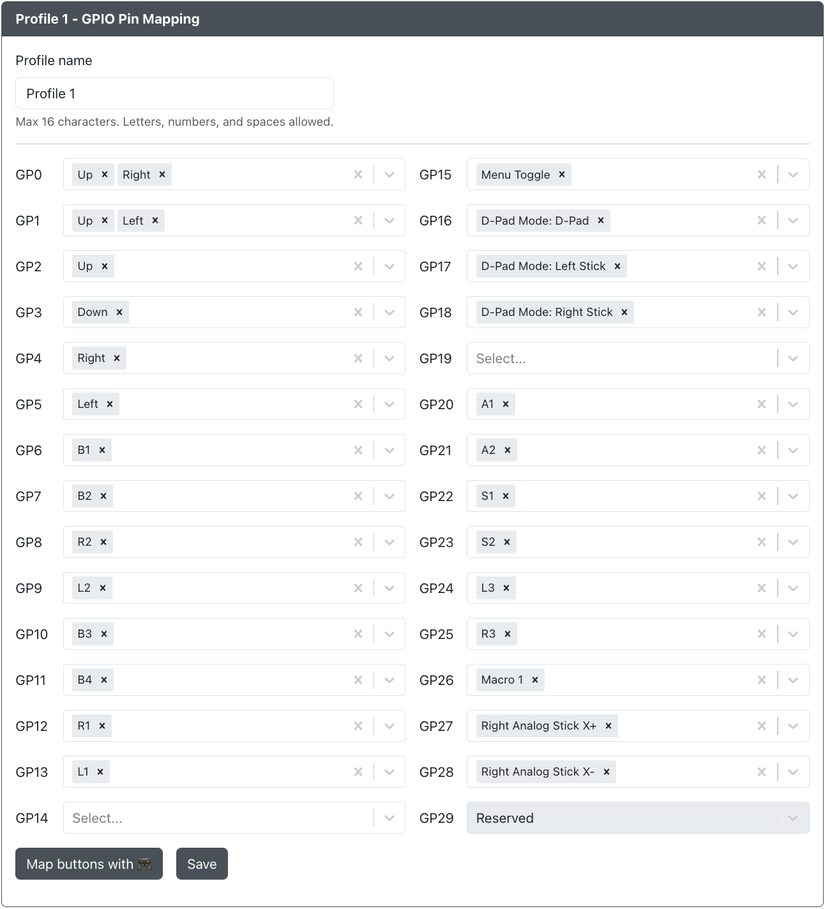

# GPIO 引脚映射

在这里，您可以将 GP2040-CE 按钮重新映射到 RP2040 芯片上的不同 GPIO 引脚。这可以用于简单地重新映射按钮或绕过设备上可能有问题的 GPIO 引脚。

以下选项可用于分配给每个 GPIO 引脚：

- 在 [按键](../../usage.mdx#按键) 中找到的标准游戏手柄输入
- D-Pad 模式：数字模式、左摇杆和右摇杆
- [双方向输入](../../add-ons/dual-direction-input.mdx)：上、下、左、右
- [SOCD 上优先](../../hotkeys.mdx#socd-上优先)
- [SOCD 回中](../../hotkeys.mdx#socd-回中)
- [SOCD 后输入优先](../../hotkeys.mdx#socd-后输入优先)
- [SOCD 先输入优先](../../hotkeys.mdx#socd-先输入优先)
- [SOCD 关闭](../../hotkeys.mdx#socd-关闭)
- [Turbo](../../add-ons/turbo.mdx)
- [宏](./09-macros.mdx)
- Function
- 额外功能

:::note
- 多个 [按键](../../usage.mdx#按键) 可以分配到单个 GPIO 引脚（例如 SOCD 覆盖和 [快捷键](../../hotkeys.mdx) 都可以激活）。
- 选项不限于单个 GPIO 引脚分配，可以多次分配（例如，GPIO 引脚 0-29 都可以分配为“向上”输入，如果需要）。

:::

## 引脚查看器 :video_game:

此工具可用于查看哪个 GPIO 引脚物理连接到某个按钮。点击按钮并按照提示操作。系统会要求您按下按钮，并显示“按下的引脚”。

## 使用 :video_game: 映射按钮

如果您不知道设备上的哪些引脚映射到哪些按钮，可以使用一个工具来帮助您。点击上图中的按钮并按照提示操作。系统会要求您依次按下在 [按键](../../usage.mdx#按键) 中找到的每个标准游戏手柄输入。

- 如果您不希望映射特定输入，可以点击 `跳过按钮` 并继续操作。
- 如果您不需要映射更多输入，可以点击 `停止捕获`。

## 档案

您可以配置档案，根据设置的档案编号更改 GPIO 到 GP2040-CE 按钮的映射。这意味着您可以为不同的使用场景设置按钮布局，并在无需进入网页配置器重新映射 GPIO 引脚的情况下切换它们。

可以通过网页配置器的 [设置页面](../../web-configurator/menu-pages/01-settings.mdx) 或使用 [快捷键](../../hotkeys.mdx#加载档案-1-4) 更改档案编号。这些 `加载 档案 #1-4`、`下一个档案` 或 `上一个档案` 快捷键快捷键没有默认输入组合，因此您可能需要在设置页面的 [快捷键设置](../../web-configurator/menu-pages/01-settings.mdx#快捷键设置) 中设置它们。首次启动时默认使用档案 #1，但会在重启后记住上次设置的档案。

### 档案名称
可以设置档案名称以帮助识别档案的用途。如果您为不同使用场景设置了多个档案，这会非常有用。如果未设置档案名称，则档案会显示为 `档案 #`，其中 `#` 是档案编号。连接的显示屏会在档案更改时显示档案名称。

### 档案启用/禁用
档案可以启用或禁用。如果档案被禁用，则使用 [快捷键](../../hotkeys.mdx "GP2040-CE | Hotkeys") 更改档案时不会显示该档案。第一个档案无法禁用。

:::info

目前，档案仅限于更改 GPIO 引脚分配，无法用于更改其他设置或与 GPIO 引脚分配无直接关系的插件。这包括但不限于以下设置和插件：

- 输入模式引导
- 快捷键
- 外围设备映射
- 键盘映射分配
- 倾斜输入
- Wii 扩展
- SNES 扩展
- 专注模式
- 键盘主机按钮到键映射

:::
