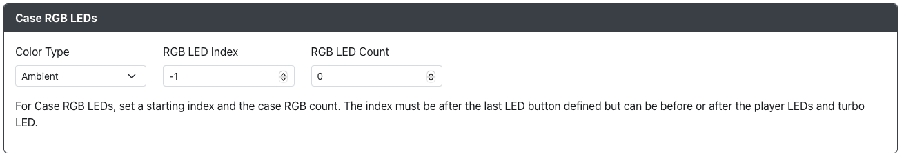

import InputLabelSelector, {
  Hotkey,
} from "@site/src/components/LabelSelector.tsx";
import { ColorBlock } from "@site/src/components/LEDColors";

# LED 配置

如果您使用了每个按键的 RGB LED 设置，可以在此处进行配置。

## RGB LED 配置

- `数据引脚` - 驱动 RGB LED 数据线的 GPIO 引脚。设置为 `-1` 可禁用 RGB LED。
- `LED 格式` - 与 RGB LED 通信使用的数据格式。如果不确定，默认的 `GRB` 通常是安全的选择。
- `LED 布局` - 选择控制器/按键的布局。这用于静态主题和某些每按键动画。
- `每按键 LED 数量` - 设置链中每个按键的 LED 数量。
- `最大亮度` - 设置 LED 的最大亮度，范围为 0-255。
- `亮度级别` - 调整亮度时的循环级别数量。

## RGB LED 按键顺序

:::note

请注意，RGB 按键 LED 必须是链中配置的第一个 LED。它们将在 RGB LED 灯条的索引 0 开始。

此外，目前每个按键在 LED 链中只能有一个实例。即使为每个按键分配了多个 LED，并且多个按键分配到不同的 GPIO 引脚，这种限制仍然适用。

:::

根据 LED 链的顺序重新排列按键。这因设备不同而异，由板和 LED 的制造商决定。

## 玩家 LED (XInput)

`玩家 LED 类型` 可选择 `无`、`PWM` 或 `RGB`。

### PWM 玩家 LED

- `PLED #[1-4] 引脚` - 标准 LED 连接的 GPIO 引脚。

### RGB 玩家 LED

:::note

请注意，RGB 玩家 LED 必须位于 LED 灯条上 RGB LED 按键之后的索引位置！Web 配置界面会根据 [RGB LED 按键顺序](#rgb-led-按键顺序) 中映射的按键数量和选择的 `每按键 LED 数量` 值建议起始索引。我们希望未来能移除此限制。

:::

- `PLED #[1-4] 索引` - RGB 灯条上 LED 模块的索引。
- `RGB PLED 颜色` - 点击框以显示颜色选择器，或手动输入颜色。

### 机壳 RGB LED

机壳 RGB LED 允许您在设备内部或外部添加额外的 RGB LED，以增强 RGB 效果。

`颜色类型` 有以下选项：
- `关闭` - 无机壳 RGB LED。
- `环境` - 机壳 RGB LED 将独立于按键 LED 设置运行。
- `关联` - 机壳 RGB LED 将匹配按键 LED 设置。

:::note

在 `环境` 模式下，您可以使用以下快捷键更改 LED 设置。

| 快捷键                                  | 描述                                               |
| --------------------------------------- | ------------------------------------------------- |
| <Hotkey buttons={["S2", "B3", "B1"]}/>  | 在 `环境`、`关联` 和 `关闭` 模式之间切换。          |
| <Hotkey buttons={["S2", "B4"]}/>        | 增加机壳 LED 的亮度。                              |
| <Hotkey buttons={["S2", "B2"]}/>        | 减少机壳 LED 的亮度。                              |
| <Hotkey buttons={["S2", "R1"]}/>        | 切换机壳 LED 的静态颜色到下一个颜色。              |
| <Hotkey buttons={["S2", "R2"]}/>        | 切换机壳 LED 的静态颜色到上一个颜色。              |
| <Hotkey buttons={["S2", "L1"]}/>        | 切换到环境模式下的下一个效果。                      |
| <Hotkey buttons={["S2", "L2"]}/>        | 切换到环境模式下的上一个效果。                      |

:::

选择 `环境` 或 `关联` 模式时，您还需要指定机壳 LED 的起始索引以及机壳 LED 的数量。
- `RGB LED 索引` - 机壳 RGB LED 在链中的起始位置。
- `RGB LED 数量` - 用于机壳 RGB LED 的 LED 数量。

:::note

索引必须位于定义的最后一个按键 LED 之后，但可以在玩家 LED 和涡轮 LED 的前后。

::: 
