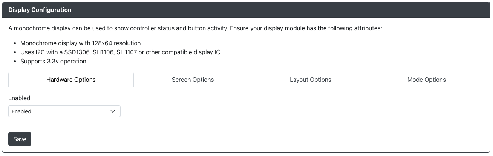
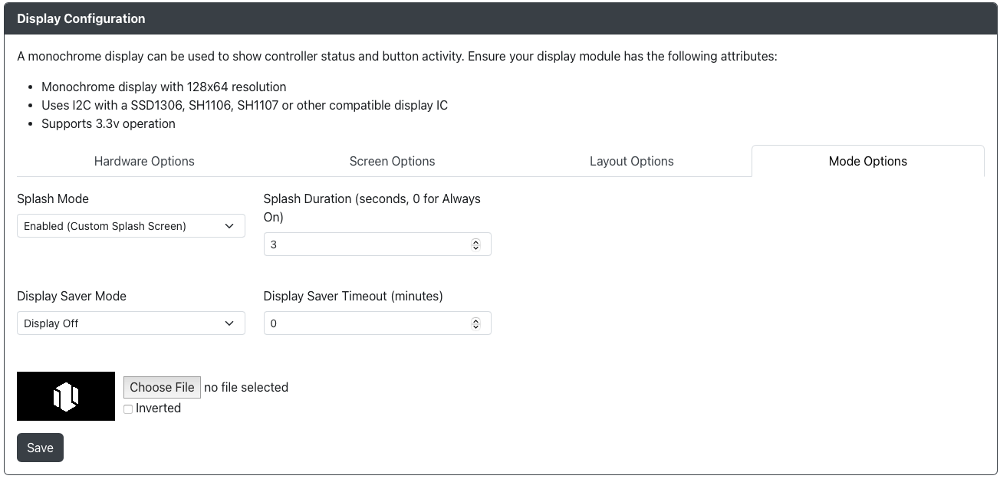
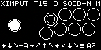

# 显示屏配置

GP2040-CE 支持使用显示模块，例如带有 SSD1306、SH1106 或 SH1107 显示 IC 的 OLED。

## 硬件选项

- `启用` - 打开/关闭显示模块。

## 屏幕选项

- `翻转显示` - 允许以多种方式翻转或镜像显示屏。
- `反向显示` - 反转像素颜色，启用后会呈现出负片效果。
- `电源管理` - 允许在挂起时关闭显示屏。

## 布局选项

:::note 按键布局组合

请确保选择匹配的左右布局。有些布局组合可能会导致屏幕上的按键重叠。

:::

## 按键布局

- `按键布局（左侧）` - 更改显示屏左侧按键和摇杆的布局。
- `按键布局（右侧）` - 更改显示屏右侧按键和摇杆的布局。
- `按键布局方向` - 允许翻转或切换整体布局。

## 状态栏布局

- `输入模式` - 允许在显示屏上显示或隐藏 `输入模式`。
- `Turbo` - 允许在显示屏上显示或隐藏 `Turbo` 设置。
- `方向模式` - 允许在显示屏上显示或隐藏 `方向模式`。
- `SOCD 模式` - 允许在显示屏上显示或隐藏 `SOCD 模式`。
- `宏模式` - 允许在显示屏上显示或隐藏 `宏模式`。
- `档案` - 允许在显示屏上显示或隐藏 `档案` 弹窗（如果启用了档案）。

## 输入历史布局

- `输入历史` - 允许显示或隐藏输入历史记录。

输入历史有以下选项：
- `历史长度（字符）` - 显示在屏幕上的 `输入历史` 字符数（默认值为 21）。
- `列` - 输入历史在屏幕上起始位置的列（默认值为 0）。
- `行` - 输入历史在屏幕上起始位置的行（默认值为 7）。

:::note

建议保持 `历史长度（字符）`、`列` 和 `行` 的默认值，除非您正在自定义显示屏。

:::

## 模式选项

- `启动画面模式` - 启用或禁用开机时显示的启动画面。
- `启动画面持续时间` - 设置启动画面在开机时显示的时长。
- `显示屏保护超时` - 在指定的分钟数后关闭显示屏。按下任何输入将重新打开显示屏。
- `选择文件` - 上传自定义图片作为启动画面。

## 自定义启动画面

建议使用 128x64 的双色图片（或适合您显示屏的尺寸）。上传其他类型的图片会自动进行转换和调整大小。

支持的格式：BMP、GIF、JPG、JPEG、PNG、WEBP

:::caution

目前不支持动态 GIF。

:::

查看我们社区的优秀自定义启动画面集合 [点此访问](../community-splash-screens.mdx)。

## 显示元素

此部分包含显示元素的说明，并提供了一个示例，展示其在设备上的显示方式。

### 顶部

从左到右，显示元素包括：

- [输入模式](../../usage.mdx#输入模式) - 显示当前的输入模式：
  - `XINPUT` - XInput
  - `SWITCH` - 任天堂 Switch
  - `DINPUT` - PS3/DirectInput
  - `HID-KB` - 键盘
  - `PS4` - 控制器模式设置为 `Controller`，认证成功后显示为 `PS4:AS`
  - `PS4:AS` - [PS4 输入模式](../../web-configurator/menu-pages/01-settings.mdx#额外的-ps4-设置) 插件认证成功
  - `PS5` - 控制器模式设置为 `Arcade Stick`，认证成功后显示为 `PS5:AS`
  - `PS5:AS` - [PS5 输入模式](../../web-configurator/menu-pages/01-settings.mdx#额外的-ps5-设置) 插件认证成功
  - `XBONE` - 兼容 [Xbox One 输入模式](./01-settings.mdx#额外的-xbox-one-设置)
  - `OGXBOX` - 原版 Xbox
  - `GEN/MD` - 世嘉 Genesis/MegaDrive Mini
  - `NGMINI` - NEOGEO Mini
  - `PCE/TG` - PC Engine/Turbografx 16 Mini
  - `EGRET` - EGRET II Mini
  - `ASTRO` - ASTROCITY Mini
  - `PSC` - PlayStation Classic
- [Turbo](../../add-ons/turbo.mdx) - 当启用 Turbo 时显示 `T##`，其中 ## 为每秒按下的次数。
- 方向模式 - 显示当前的方向模式：
  - `D` - [十字键模式](../../hotkeys.mdx#十字键模式)
  - `L` - [左摇杆模式](../../hotkeys.mdx#左摇杆模式)
  - `R` - [右摇杆模式](../../hotkeys.mdx#右摇杆模式)
- SOCD 覆盖模式 - 显示当前的 SOCD 覆盖模式：
  - `SOCD-U` - [SOCD 上优先](../../hotkeys.mdx#socd-上优先)
  - `SOCD-N` - [SOCD 回中](../../hotkeys.mdx#socd-回中)
  - `SOCD-L` - [SOCD 后输入优先](../../hotkeys.mdx#socd-后输入优先)
  - `SOCD-F` - [SOCD 先输入优先](../../hotkeys.mdx#socd-先输入优先)
  - `SOCD-X` - [SOCD 关闭](../../hotkeys.mdx#socd-关闭)
- [宏](./09-macros.mdx) - 如果启用宏，`M` 会显示，无法禁用。

### 中间

此部分的显示取决于左侧和右侧 [按键布局](#布局选项) 的具体配置。

- Turbo 环 - 当在单个按键上启用 Turbo 模式时，该按键将显示一个较小的内环作为指示器。禁用时，该按键将消失。

### 底部

- 输入历史 - 当启用并配置 [输入历史](../../add-ons/input-history.mdx) 插件时，将显示输入历史。
