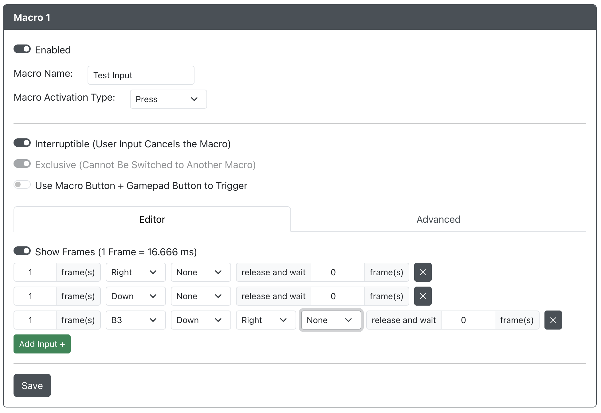
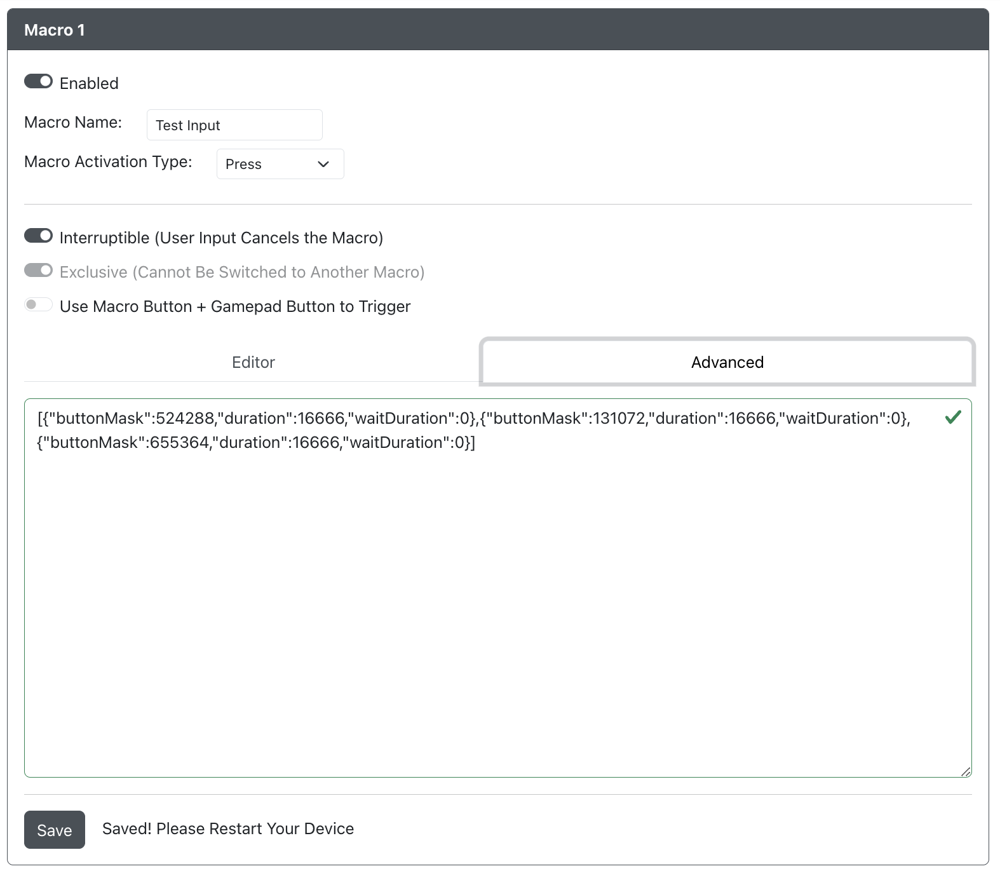

# 宏配置

宏是一系列或组合的游戏手柄输入，可以通过单个按钮或按钮组合触发。

## 宏选项

`宏按钮引脚` - 当启用了并设置了 `使用按钮` 时，用于激活宏的 GPIO 引脚。

### 标签

这是宏的名称，填写与否均可。

### 激活

- `关闭` - 宏不可用。
- `开启` - 宏可用，当通过 GPIO 引脚或在 [`使用按钮`](#使用按钮) 中设置的组合触发时生效。

### 可中断

- `关闭` - 宏无法被中断，所有行将执行完毕直到宏完成。
- `开启` - 任何输入都会停止当前正在执行的宏，或者如果输入是另一个宏，则中断的宏触发将开始执行。

:::note 中断宏

当一个宏因任何原因停止后再次触发时，宏将从头开始执行。

:::

### 独占

- `关闭` - 用户的额外输入会在宏执行时同时发送，从而导致宏输入与用户输入的混合。
- `开启` - 仅过滤宏输入，排除任何额外的用户游戏手柄输入。

:::note

此选项**仅**在 `可中断` 被禁用时可用。

:::

### 显示帧数

- `关闭` - 宏输入行编辑器中的持续时间将以毫秒 (ms) 显示。
- `开启` - 宏输入行编辑器中的持续时间将以帧数显示，假设每秒 60 帧。

### 使用按钮

- `关闭` - 此宏分配给板上的 GPIO 引脚，当按下时，宏将被触发。
- `开启` - 此宏分配给一个按钮组合 `宏按钮引脚 + 输入`，其中输入可以是任何标准的游戏手柄输入。

### 触发模式

描述了 GPIO 引脚或在 [`使用按钮`](#使用按钮) 中设置的组合如何触发和重复宏。

- 按下 - 按下按钮会触发宏一次。
- 按住重复 - 按住按钮会重复触发宏。
- 切换 - 按下按钮会使宏重复触发，再次按下按钮会停止宏的重复触发。

## 宏输入行编辑器

每个宏最多可以包含 30 行，每行最多可以包含 18 个游戏手柄输入（使用所有可用的游戏手柄输入）。

在 `编辑器` 标签中，每行输入由以下元素从左到右组成：

`输入行持续时间` 毫秒/帧 `输入` | `后输入等待持续时间` 毫秒

- 输入行持续时间 - 输入保持的时间。（最大值为 4,294,967 毫秒或 268,435 帧）
- 输入 - 执行输入行期间要保持的输入。
- 后输入等待持续时间 - 当前输入行执行完毕后与下一行开始执行之间的时间间隔。（最大值为 4,294,967 毫秒或 268,435 帧）

:::note 删除输入行

要删除一个输入行，双击 "x" 按钮。

:::

## 高级宏输入行编辑器

`高级` 部分允许您复制和粘贴宏，方便分享。

在这里，您可以复制和粘贴您制作的宏以便分享，也可以导入他人制作并分享的宏。

:::warning

尽管可以在此处编写宏，但建议仍然使用 `编辑器` 标签在 UI 中从头创建宏。

:::
