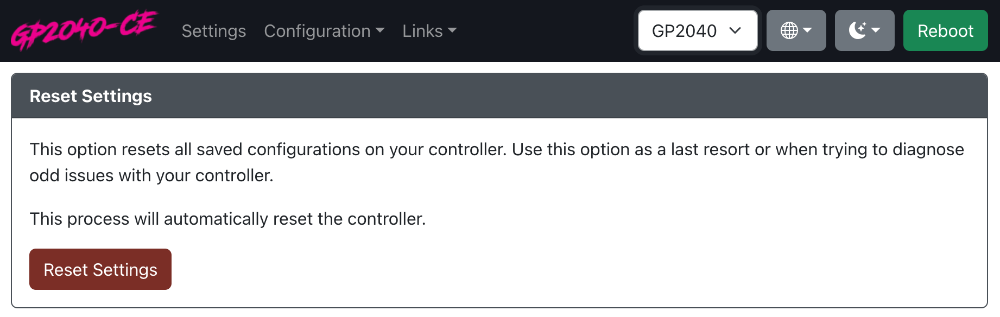

# 重置设置

`重置设置` 选项会将所有设置恢复为原始板配置设置。

:::note

请注意，如果您使用的是某人制作的自定义设备，并且他们使用了基础配置并进行了更改，这可能会导致设备上的功能和更改无法正常工作。

这种情况可能仅发生在未包含在我们主发行版中的设备上。

如果您的设备未列在我们主发行版中，建议在重置设置之前联系卖家。

GP2040-CE 无法协助解决与未包含在我们发行版中的设备相关的配置问题。

:::
