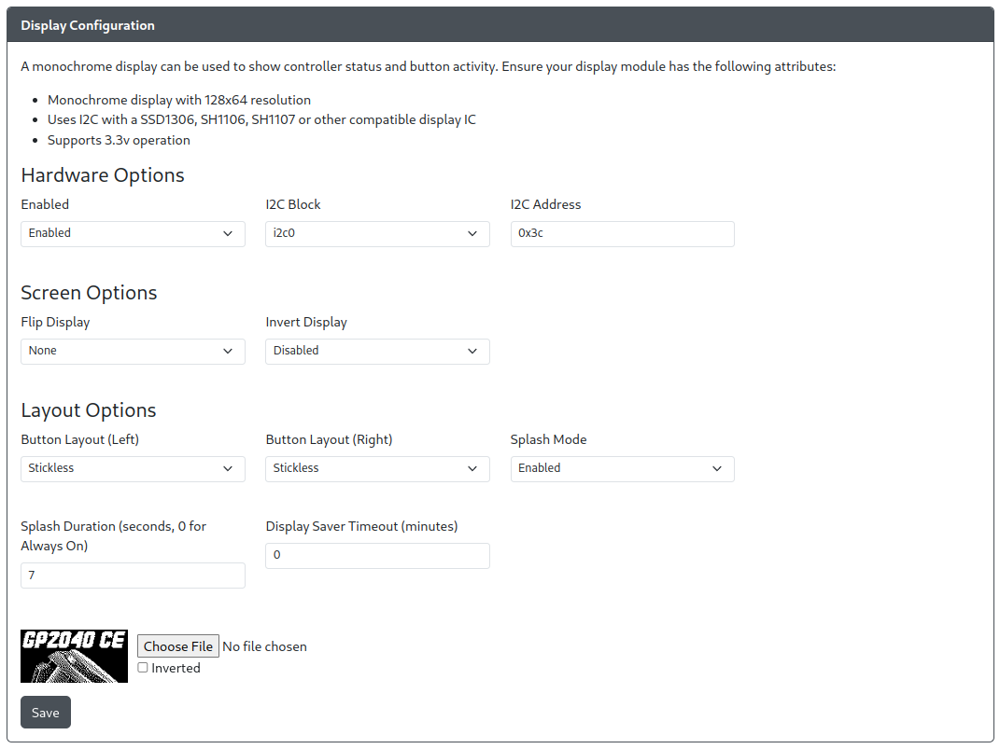

# Display Configuration

GP2040-CE supports the use of a display module such as an OLED with a SSD1306, SH1106, or SH1107 display IC.

## Hardware Options

- `Enabled` - Turns on/off the display module.
- `I2C Block` - The Pico I2C block that will be used. Set based on pins, refer to table on page.
- `I2C Address` - The I2C address of your device, defaults to the very commonly used `0x3C`.

## Screen Options

- `Flip Display` - Allows you to flip or mirror the display in a variety of ways.
- `Invert Display` - Inverts the pixel colors, effectively giving you a negative image when enabled.

## Layout Options

:::note Button Layout Combinations

Be sure to pick left and right layouts that match. Some layout combinations result in overlapping buttons on the screen.

:::

- `Button Layout (Left)` - Changes the onscreen layout for the left side of the display and stick.
- `Button Layout (Right)` - Changes the onscreen layout for the right side of the display and stick.
- `Splash Mode` - Enables or disables a splash screen displaying when the unit is turned on.
- `Splash Duration` - Sets the amount of time the splash screen displays for on boot.
- `Display Saver Timeout` - Will cause the display to turn off after the specified number of minutes. Pressing any input will cause the display to turn back on.
- `Choose File` - This will allow you to upload your own image to be used for the splash screen. It is recommend that you use a two color 128x64 image (or one that is sized appropriately for your display). Uploading any other type of image will result in a conversion and sizing of the image automatically. If the image is inverted upon upload, just check off the `Invert` box.

Check out our collection of great custom splash screens from the community [HERE](../community-splash-screens.mdx)
